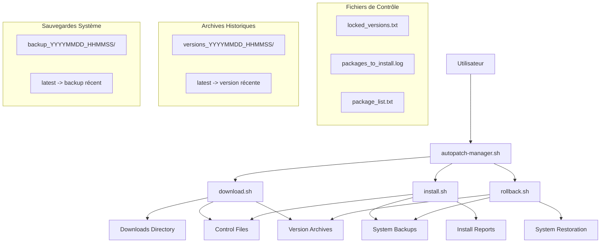

# ARCHITECTURE GÉNÉRALE DU SYSTÈME AUTOPATCH

## Vue d'Ensemble

Le système AutoPatch est une solution complète et sécurisée pour la gestion automatisée des mises à jour système Linux. Il sépare intelligemment les phases de **téléchargement** et **d'installation** pour garantir un contrôle total sur les versions déployées.

## Philosophie de Conception

### Sécurité par Conception
- **Verrouillage des versions** : Impossible d'installer une version non approuvée
- **Séparation des phases** : Téléchargement ≠ Installation
- **Traçabilité complète** : Historique de toutes les opérations
- **Rollback intelligent** : Retour rapide à un état stable

### Workflow Sécurisé
```
Phase 1: TÉLÉCHARGEMENT    Phase 2: VALIDATION    Phase 3: INSTALLATION
┌─────────────────────────┐ ┌────────────────────┐ ┌─────────────────────────┐
│    download.sh          │ │    Équipes Sécurité│ │    install.sh           │
│ • Détection distro      │ │ • Analyse versions  │ │ • Vérif versions        │
│ • Téléchargement        │ │ • Tests sécurité    │ │ • Installation sécur.   │
│ • Génération contrôles  │ │ • Approbation       │ │ • Sauvegarde optionn.   │
│ • Verrouillage versions │ │                    │ │                         │
└─────────────────────────┘ └────────────────────┘ └─────────────────────────┘
         │                            │                            │
         └────────────── locked_versions.txt ──────────────────┘
```

## Architecture des Composants

### Diagramme Architectural

```
                               AUTOPATCH-MANAGER.SH
                                  ║ (Orchestrateur Central)
                                  ║
                    ┌─────────────╬─────────────┐
                    │             ║             │
                    ▼             ▼             ▼
              DOWNLOAD.SH      INSTALL.SH      ROLLBACK.SH
                    │             │             │
                    │             │             │
              ┌─────┴─────┐ ┌─────┴─────┐ ┌─────┴─────┐
              │           │ │           │ │           │
              ▼           ▼ ▼           ▼ ▼           ▼
        Downloads       Control    Execution     Backups
        /var/tmp/     Files       System        /var/tmp/
        autopatch_    • locked_  Packages      autopatch_
        downloads/    versions.  • APT         backups/
        • *.deb       txt        • DNF/YUM
        • *.rpm       • packages  • Pacman
        • *.pkg.tar.* _log
                      • archives
```

### Composants Principaux

#### 1. **autopatch-manager.sh** - Le Chef d'Orchestre
```bash
RÔLE PRINCIPAL
├── Interface unifiée pour tous les scripts
├── Vérification de l'intégrité des composants
├── Gestion des démons systemd
├── Transmission cohérente des arguments
└── Coordination des opérations complexes

FONCTIONNALITÉS CLÉS
├── Commandes : download, install, rollback, full-update, auto-update
├── Gestion daemon : create, enable, disable, remove, config, status
├── Vérifications : check, status, setup
├── Options globales : --verbose, --dry-run, --force
└── Codes de retour standardisés

FICHIERS GÉRÉS
├── Configuration : /etc/autopatch/manager.conf
├── Logs centraux : /var/log/autopatch/manager.log
├── Verrous : /var/run/autopatch_manager.lock
└── Scripts : autopatch-scripts/*.sh
```

#### 2. **download.sh** - Le Téléchargeur Sécurisé
```bash
RÔLE PRINCIPAL
├── Détection automatique de la distribution Linux
├── Téléchargement des paquets de mise à jour
├── Génération des fichiers de contrôle sécurisés
├── Archivage historique pour rollback
└── Vérification d'intégrité des paquets

FONCTIONNALITÉS CLÉS
├── Multi-distribution : APT, DNF/YUM, Pacman
├── Vérification intégrité : signatures, checksums
├── Nettoyage automatique : conservation N-1
├── Résumés détaillés : statistiques, logs
└── Mode verbeux : détails complets

FICHIERS GÉNÉRÉS
├── Téléchargements : /var/tmp/autopatch_downloads/
│   ├── *.deb / *.rpm / *.pkg.tar.* (paquets)
│   ├── package_list.txt (liste simple)
│   ├── packages_to_install.log (format lisible)
│   ├── locked_versions.txt (versions verrouillées)
│   ├── download_summary.txt (résumé détaillé)
│   └── versions_history/ (archives N-5)
├── Logs : /var/log/autopatch/download.log
└── Verrous : /var/run/autopatch_download.lock
```

#### 3. **install.sh** - L'Installateur Contrôlé
```bash
RÔLE PRINCIPAL
├── Vérification stricte des versions autorisées
├── Installation exclusive des paquets téléchargés
├── Création de sauvegardes pré-installation
├── Nettoyage post-installation
└── Rapports détaillés d'installation

FONCTIONNALITÉS CLÉS
├── Sécurité renforcée : contrôle locked_versions.txt
├── Sauvegarde optionnelle : --backup
├── Mode simulation : --dry-run
├── Support multi-distribution
└── Génération de résumés

MÉCANISMES DE SÉCURITÉ
├── Vérification obligatoire des fichiers de contrôle
├── Comparaison version par version
├── Refus d'installation si version non autorisée
├── Logging détaillé des opérations
└── Sauvegarde préventive optionnelle

FICHIERS UTILISÉS
├── Contrôles (lecture) :
│   ├── locked_versions.txt (versions autorisées)
│   ├── packages_to_install.log (liste lisible)
│   └── package_list.txt (liste simple)
├── Sauvegardes (création) :
│   └── /var/tmp/autopatch_backups/backup_YYYYMMDD_HHMMSS/
├── Logs : /var/log/autopatch/install.log
└── Verrous : /var/run/autopatch_install.lock
```

#### 4. **rollback.sh** - Le Gestionnaire de Sauvegardes
```bash
RÔLE PRINCIPAL
├── Création de sauvegardes système complètes
├── Restauration vers des points de sauvegarde
├── Gestion intelligente de la rétention (N-3)
├── Rollback vers versions de paquets historiques
└── Interface interactive conviviale

FONCTIONNALITÉS CLÉS
├── Actions : save, list, restore, cleanup
├── Actions étendues : list-versions, restore-version
├── Menu interactif : navigation guidée
├── Support multi-distribution
└── Métadonnées complètes

TYPES DE RESTAURATION
├── Restauration système complète :
│   └── Retour vers un backup_YYYYMMDD_HHMMSS
├── Restauration de versions de paquets :
│   └── Retour vers versions_YYYYMMDD_HHMMSS
└── Nettoyage automatique des anciennes sauvegardes

FICHIERS GÉRÉS
├── Sauvegardes système : /var/tmp/autopatch_backups/
│   ├── backup_YYYYMMDD_HHMMSS/
│   │   ├── installed_packages.txt
│   │   ├── backup_metadata.txt
│   │   ├── backup_version.txt
│   │   └── [configs spécifiques distribution]
│   └── latest -> backup_le_plus_récent
├── Archives versions : /var/tmp/autopatch_downloads/versions_history/
│   ├── versions_YYYYMMDD_HHMMSS/
│   │   ├── locked_versions.txt
│   │   ├── packages_to_install.log
│   │   └── version_metadata.txt
│   └── latest -> version_la_plus_récente
├── Logs : /var/log/autopatch/rollback.log
└── Verrous : /var/run/autopatch_rollback.lock
```

## Flux de Données et Interactions

### Diagramme de Flux Principal



### Flux de Sécurité des Versions

```
CYCLE DE VIE DES VERSIONS

TÉLÉCHARGEMENT (Lundi 02:00)
   ┌─────────────────────────────────────────┐
   │ download.sh                             │
   │ ├── Télécharge apache 2.4.1            │
   │ ├── Génère locked_versions.txt          │
   │ │   └── "apache=2.4.1"                 │
   │ └── Archive dans versions_20240722/     │
   └─────────────────────────────────────────┘
              │
              ▼
   ┌─────────────────────────────────────────┐
   │    PÉRIODE DE VALIDATION                │
   │ Équipes sécurité analysent apache 2.4.1│
   │ Tests, audits, approbation              │
   └─────────────────────────────────────────┘
              │
              ▼
INSTALLATION (Mercredi 02:30)
   ┌─────────────────────────────────────────┐
   │ install.sh                              │
   │ ├── Lit locked_versions.txt             │
   │ ├── Vérifie version apache              │
   │ │   ├── Si 2.4.1 → Installation         │
   │ │   └── Si 2.4.2 → REFUS                │
   │ └── Installation UNIQUEMENT 2.4.1      │
   └─────────────────────────────────────────┘

GARANTIE DE SÉCURITÉ
Même si apache 2.4.2 sort mardi, seul apache 2.4.1 sera installé !
```

## Structure des Fichiers et Répertoires

### Arborescence Complète

```
/
├── RÉPERTOIRE D'INSTALLATION
│   ├── autopatch-manager.sh              # Script principal
│   ├── autopatch-scripts/                # Sous-scripts
│   │   ├── download.sh
│   │   ├── install.sh
│   │   └── rollback.sh
│   └── documentation/                    # Cette documentation
│
├── CONFIGURATION SYSTÈME
│   ├── /etc/autopatch/                   # Configuration
│   │   └── manager.conf                  # Paramètres démons
│   └── /etc/systemd/system/              # Services systemd
│       ├── autopatch-download.service
│       ├── autopatch-download.timer
│       ├── autopatch-install.service
│       └── autopatch-install.timer
│
├── DONNÉES DE TRAVAIL
│   ├── /var/tmp/autopatch_downloads/     # Zone téléchargements
│   │   ├── *.deb, *.rpm, *.pkg.tar.*    # Paquets
│   │   ├── package_list.txt              # Liste simple
│   │   ├── packages_to_install.log       # Format lisible
│   │   ├── locked_versions.txt           # Versions verrouillées
│   │   ├── download_summary.txt          # Résumé téléchargement
│   │   └── versions_history/             # Archives historiques
│   │       ├── versions_20240722_020000/
│   │       ├── versions_20240729_020000/
│   │       └── latest -> versions_récent
│   └── /var/tmp/autopatch_backups/       # Zone sauvegardes
│       ├── backup_20240722_020000/       # Sauvegarde système
│       ├── backup_20240724_020000/
│       └── latest -> backup_récent
│
├── LOGS ET MONITORING
│   ├── /var/log/autopatch/               # Logs centralisés
│   │   ├── manager.log                   # Log orchestrateur
│   │   ├── download.log                  # Log téléchargements
│   │   ├── install.log                   # Log installations
│   │   └── rollback.log                  # Log sauvegardes/restos
│   └── /var/run/                         # Verrous processus
│       ├── autopatch_manager.lock
│       ├── autopatch_download.lock
│       ├── autopatch_install.lock
│       └── autopatch_rollback.lock
```

### Formats des Fichiers de Contrôle

#### locked_versions.txt (Sécurité)
```bash
# Format: PAQUET=VERSION_EXACTE
apache2=2.4.41-4ubuntu3.14
nginx=1.18.0-6ubuntu14.3
mysql-server=8.0.34-0ubuntu0.22.04.1
```

#### packages_to_install.log (Lisible)
```bash
# LISTE DES PAQUETS À INSTALLER
# Date : 2024-07-22 02:00:15
# Distribution : ubuntu
# Gestionnaire : apt

apache2 2.4.41-4ubuntu3.13 -> 2.4.41-4ubuntu3.14
nginx 1.18.0-6ubuntu14.2 -> 1.18.0-6ubuntu14.3
mysql-server 8.0.33-0ubuntu0.22.04.1 -> 8.0.34-0ubuntu0.22.04.1
```

#### backup_metadata.txt (Sauvegarde)
```bash
=== MÉTADONNÉES DE SAUVEGARDE ===
Nom de la sauvegarde: backup_20240722_020000
Date de création: 2024-07-22 02:00:00
Distribution: ubuntu
Gestionnaire de paquets: apt
Nombre de paquets installés: 2847
```

## Intégrations et Extensibilité

### Intégration Systemd

Le système s'intègre parfaitement avec systemd pour l'automatisation :

```bash
# Services créés automatiquement
autopatch-download.timer    # Déclenche le téléchargement
autopatch-download.service  # Exécute download.sh

autopatch-install.timer     # Déclenche l'installation
autopatch-install.service   # Exécute install.sh
```

### Points d'Extension

```bash
ARCHITECTURE MODULAIRE
├── Détection distribution : Facilement extensible
├── Gestionnaires de paquets : Interface standardisée
├── Formats de sauvegarde : Métadonnées structurées
├── Notifications : Hooks disponibles
└── Intégrations : APIs standardisées
```

### Support Multi-Distribution

| Distribution | Statut | Gestionnaire | Fonctionnalités |
|-------------|--------|-------------|----------------|
| **Ubuntu/Debian** | Complet | APT | Tout supporté |
| **CentOS/RHEL** | Complet | YUM/DNF | Tout supporté |
| **Fedora** | Complet | DNF | Tout supporté |
| **Arch Linux** | Complet | Pacman | Tout supporté |

## Interfaces et APIs

### Interface Ligne de Commande

```bash
# Interface unifiée via le manager
sudo ./autopatch-manager.sh [COMMAND] [OPTIONS]

# Commandes principales
COMMAND ∈ {download, install, rollback, full-update, auto-update, 
           status, setup, check, cleanup, daemon}

# Options globales
OPTIONS ∈ {--verbose, --dry-run, --force, --help}

# Options spécifiques
install: --backup
rollback: save|list|restore|cleanup|list-versions|restore-version
```

### Codes de Retour Standardisés

| Code | Signification | Scripts Concernés |
|------|--------------|------------------|
| **0** | Succès | Tous |
| **1** | Erreur générale/sécurité | Tous |
| **2** | Ressource non trouvée | Tous |
| **3** | Erreur de permission | Tous |
| **4** | Échec opération | install.sh, rollback.sh |
| **5** | Annulation utilisateur | rollback.sh |
| **6** | Configuration invalide | manager |

---

## Points de Contact

### Débogage et Logs
```bash
# Logs temps réel
sudo tail -f /var/log/autopatch/*.log

# Vérification état
sudo ./autopatch-manager.sh status

# Diagnostic complet
sudo ./autopatch-manager.sh check
```

### Maintenance
```bash
# Nettoyage régulier
sudo ./autopatch-manager.sh cleanup

# Vérification intégrité
sudo ./autopatch-manager.sh check

# Gestion des services
sudo ./autopatch-manager.sh daemon status
```

---

**Auteur** : DECARNELLE Samuel  
**Version** : 1.0  
**Date** : 2025-07-22

> **Cette architecture garantit** la sécurité, la traçabilité et la réversibilité de toutes les opérations de mise à jour système.
