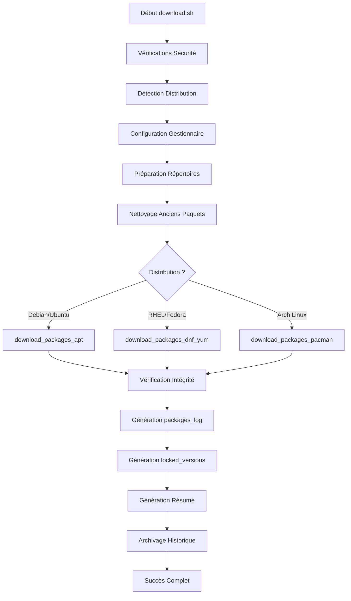

# DOCUMENTATION - DOWNLOAD.SH

## Vue d'Ensemble

**download.sh** est le **script de téléchargement intelligent** du système AutoPatch. Il se charge de récupérer les mises à jour de sécurité disponibles et de préparer l'installation en créant les fichiers de contrôle nécessaires.

## Rôle et Mission Critique

Le script download.sh assure plusieurs fonctions vitales :
- **Téléchargement sécurisé** des paquets de mise à jour disponibles
- **Gestion multi-distribution** avec détection automatique du système
- **Archivage historique** des versions pour rollback ultérieur
- **Validation d'intégrité** des paquets téléchargés
- **Création de rapports** détaillés des opérations

### Détection Multi-Distribution

## Rôle et Mission Critique

### Gardien de la Sécurité des Versions
- **Téléchargement contrôlé** : Récupération des paquets sans installation
- **Verrouillage des versions** : Génération du fichier `locked_versions.txt`
- **Traçabilité complète** : Documentation détaillée de chaque opération
- **Archivage historique** : Conservation des versions pour rollback

### Détection Multi-Distribution
- **Auto-détection** : Identification automatique de la distribution Linux
- **Support universel** : Debian/Ubuntu, CentOS/RHEL/Fedora, Arch Linux
- **Adaptation intelligente** : Configuration automatique du gestionnaire de paquets

## Architecture Technique

### Structure Modulaire Complète

```bash
download.sh
├── FONCTIONS UTILITAIRES
│   ├── log_message()              # Logging avec niveaux de gravité
│   ├── show_help()                # Aide contextuelle détaillée
│   ├── check_root()               # Vérification privilèges root
│   ├── create_lock()              # Système de verrous anti-collision
│   ├── remove_lock()              # Nettoyage verrous
│   └── cleanup_on_exit()          # Gestionnaire signaux propre
│
├── DÉTECTION ET CONFIGURATION
│   ├── detect_distribution()      # Détection distribution Linux
│   │   ├── Méthode 1: /etc/os-release (standard moderne)
│   │   ├── Méthode 2: lsb_release (alternative)
│   │   └── Méthode 3: fichiers spécifiques (/etc/debian_version, etc.)
│   ├── configure_package_manager() # Configuration gestionnaire paquets
│   └── prepare_directories()       # Création structure répertoires
│
├── TÉLÉCHARGEMENT PAR GESTIONNAIRE
│   ├── download_packages_apt()     # Téléchargement APT (Debian/Ubuntu)
│   │   ├── apt-get update         # Mise à jour listes paquets
│   │   ├── apt list --upgradable  # Liste paquets à upgrader
│   │   └── apt-get download       # Téléchargement sans installation
│   ├── download_packages_dnf_yum() # Téléchargement DNF/YUM (RHEL/Fedora)
│   │   ├── dnf/yum clean all      # Nettoyage cache
│   │   ├── dnf/yum makecache      # Mise à jour métadonnées
│   │   ├── dnf/yum list updates   # Liste paquets disponibles
│   │   └── dnf/yum download       # Téléchargement paquets
│   └── download_packages_pacman()  # Téléchargement Pacman (Arch Linux)
│       ├── pacman -Sy             # Synchronisation base données
│       ├── pacman -Qu             # Liste paquets à upgrader
│       └── pacman -Sw             # Téléchargement sans installation
│
├── VÉRIFICATION ET SÉCURITÉ
│   ├── verify_package_integrity()  # Vérification intégrité paquets
│   │   ├── Validation signatures (si disponible)
│   │   ├── Vérification checksums
│   │   └── Test intégrité fichiers
│   └── cleanup_old_packages()     # Nettoyage anciennes versions (N-1)
│
├── GÉNÉRATION FICHIERS CONTRÔLE
│   ├── generate_packages_log()         # Format lisible équipes
│   │   ├── Informations détaillées paquets
│   │   ├── Versions anciennes → nouvelles
│   │   └── Métadonnées système complètes
│   ├── generate_locked_versions_file() # Fichier sécurité critique
│   │   ├── Format: PAQUET=VERSION_EXACTE
│   │   ├── Extraction versions téléchargées
│   │   └── Génération empreintes sécurité
│   └── generate_download_summary()     # Résumé opérations
│       ├── Statistiques téléchargement
│       ├── Tailles et nombres
│       └── Informations système
│
├── ARCHIVAGE HISTORIQUE
│   └── archive_version_files()    # Archivage pour rollback
│       ├── Création versions_YYYYMMDD_HHMMSS/
│       ├── Copie fichiers contrôle
│       ├── Métadonnées versioning
│       ├── Lien symbolique 'latest'
│       └── Nettoyage anciennes versions (N-5)
│
└── ORCHESTRATION PRINCIPALE
    ├── download_packages()        # Fonction principale téléchargement
    └── main()                    # Point d'entrée et gestion arguments
```

## Support Multi-Distribution

### Détection Intelligente des Distributions

La fonction `detect_distribution()` utilise une approche en cascade pour une détection fiable :

```bash
MÉTHODE 1: /etc/os-release (Standard moderne)
├── Source du fichier de métadonnées système
├── Variable ID utilisée pour identification
└── Supporté par toutes les distributions récentes

MÉTHODE 2: lsb_release (Alternative robuste)
├── Commande standardisée Linux Standard Base
├── Conversion en minuscules pour cohérence
└── Fallback si os-release indisponible

MÉTHODE 3: Fichiers spécifiques (Legacy)
├── /etc/debian_version → debian
├── /etc/redhat-release → centos/rhel/fedora (détection fine)
├── /etc/arch-release → arch
└── Support distributions anciennes
```

### Configuration des Gestionnaires de Paquets

| Distribution | Gestionnaire | Commande Update | Commande Download | Formats |
|-------------|-------------|-----------------|-------------------|---------|
| **Debian/Ubuntu** | APT | `apt-get update` | `apt-get download` | *.deb |
| **CentOS/RHEL 7** | YUM | `yum makecache` | `yum download` | *.rpm |
| **CentOS/RHEL 8+/Fedora** | DNF | `dnf makecache` | `dnf download` | *.rpm |
| **Arch Linux** | Pacman | `pacman -Sy` | `pacman -Sw` | *.pkg.tar.* |

## Processus de Téléchargement Détaillé

### Workflow Complet de Téléchargement



### Détail des Phases par Gestionnaire

#### **APT (Debian/Ubuntu)**
```bash
download_packages_apt() {
    # 1. Mise à jour des métadonnées
    apt-get update
    
    # 2. Obtention liste paquets upgradeables
    upgradable_packages=$(apt list --upgradable 2>/dev/null | awk 'NR>1 {print $1}' | cut -d'/' -f1)
    
    # 3. Téléchargement dans répertoire cible
    cd "$DOWNLOAD_DIR"
    apt-get download $upgradable_packages
    
    # 4. Génération liste des paquets téléchargés
    echo "$upgradable_packages" >> package_list.txt
}
```

#### **DNF/YUM (RHEL/Fedora)**
```bash
download_packages_dnf_yum() {
    # 1. Nettoyage et mise à jour cache
    $PACKAGE_MANAGER_CMD clean all
    $PACKAGE_MANAGER_CMD makecache
    
    # 2. Liste des mises à jour disponibles
    upgradable_packages=$($PACKAGE_MANAGER_CMD list updates 2>/dev/null | awk 'NR>1 {print $1}' | cut -d'.' -f1)
    
    # 3. Téléchargement avec destination
    cd "$DOWNLOAD_DIR"
    $PACKAGE_MANAGER_CMD download $upgradable_packages
}
```

#### **Pacman (Arch Linux)**
```bash
download_packages_pacman() {
    # 1. Synchronisation base de données
    pacman -Sy
    
    # 2. Liste paquets obsolètes
    upgradable_packages=$(pacman -Qu | awk '{print $1}')
    
    # 3. Téléchargement sans installation
    pacman -Sw --noconfirm --cachedir "$DOWNLOAD_DIR" $upgradable_packages
}
```

## Génération des Fichiers de Contrôle Sécurisés

### packages_to_install.log (Format Lisible)

Ce fichier est conçu pour être lu et validé par les équipes de sécurité :

```bash
# ================================================================
# LISTE DES PAQUETS À INSTALLER
# ================================================================
# Date de génération : 2024-07-22 14:30:15
# Serveur            : serveur-prod-01.exemple.com
# Distribution       : ubuntu
# Gestionnaire       : apt
# ================================================================
#
# Format : PAQUET_NAME VERSION_ACTUELLE -> VERSION_DESTINATION
#

apache2 2.4.41-4ubuntu3.13 -> 2.4.41-4ubuntu3.14
nginx 1.18.0-6ubuntu14.2 -> 1.18.0-6ubuntu14.3
mysql-server-8.0 8.0.33-0ubuntu0.22.04.1 -> 8.0.34-0ubuntu0.22.04.1
openssh-server 1:8.9p1-3ubuntu0.3 -> 1:8.9p1-3ubuntu0.4
curl 7.81.0-1ubuntu1.13 -> 7.81.0-1ubuntu1.14

# ================================================================
# Fin de la liste - 2024-07-22 14:32:28
# ================================================================
```

### locked_versions.txt (Fichier Sécurité Critique)

Ce fichier verrouille exactement les versions qui peuvent être installées :

```bash
# ================================================================
# VERSIONS VERROUILLÉES POUR INSTALLATION SÉCURISÉE
# ================================================================
# Date de verrouillage : 2024-07-22 14:30:15
# Serveur              : serveur-prod-01.exemple.com
# Distribution         : ubuntu
# Gestionnaire         : apt
# ================================================================
#
# Ce fichier garantit que seules les versions spécifiées ci-dessous
# seront installées, même si des versions plus récentes sont disponibles.
# Format : PAQUET_NAME=VERSION_EXACTE
#

apache2=2.4.41-4ubuntu3.14
nginx=1.18.0-6ubuntu14.3
mysql-server-8.0=8.0.34-0ubuntu0.22.04.1
openssh-server=1:8.9p1-3ubuntu0.4
curl=7.81.0-1ubuntu1.14

# ================================================================
# Fin du verrouillage - 2024-07-22 14:32:28
# ================================================================
```

### download_summary.txt (Résumé des Opérations)

```bash
=== RÉSUMÉ DE TÉLÉCHARGEMENT ===
Date: 2024-07-22 14:32:28
Distribution: ubuntu
Gestionnaire de paquets: apt
Répertoire de téléchargement: /var/tmp/autopatch_downloads

=== STATISTIQUES ===
Nombre de paquets téléchargés: 5
Taille totale: 125M

=== FICHIERS TÉLÉCHARGÉS ===
total 125M
-rw-r--r-- 1 root root  45M Jul 22 14:31 apache2_2.4.41-4ubuntu3.14_amd64.deb
-rw-r--r-- 1 root root  12M Jul 22 14:31 nginx_1.18.0-6ubuntu14.3_amd64.deb
-rw-r--r-- 1 root root  58M Jul 22 14:32 mysql-server-8.0_8.0.34-0ubuntu0.22.04.1_amd64.deb
-rw-r--r-- 1 root root 8.2M Jul 22 14:32 openssh-server_8.9p1-3ubuntu0.4_amd64.deb
-rw-r--r-- 1 root root 1.8M Jul 22 14:32 curl_7.81.0-1ubuntu1.14_amd64.deb
```

## Vérification d'Intégrité des Paquets

### Mécanismes de Validation

La fonction `verify_package_integrity()` implémente une vérification multi-niveaux :

```bash
VÉRIFICATION PAR GESTIONNAIRE DE PAQUETS

APT (Debian/Ubuntu)
├── dpkg --info paquet.deb     # Validation structure
├── dpkg -I paquet.deb         # Vérification métadonnées  
└── Contrôle signatures GPG (si configuré)

DNF/YUM (RHEL/Fedora)
├── rpm -qp paquet.rpm         # Validation RPM
├── rpm --checksig paquet.rpm  # Vérification signatures
└── Contrôle intégrité fichier

Pacman (Arch Linux)
├── pacman -Qp paquet.pkg.tar.xz  # Validation Pacman
├── Vérification checksums intégrées
└── Contrôle signatures PGP
```

### Gestion des Erreurs d'Intégrité

```bash
if verify_package_integrity; then
    log_message "INFO" "Vérification d'intégrité réussie pour tous les paquets"
    return 0
else
    log_message "ERROR" "Échec de la vérification d'intégrité"
    log_message "ERROR" "Des paquets corrompus ont été détectés"
    return 1
fi
```

## Archivage Historique et Rollback

### Structure d'Archivage

La fonction `archive_version_files()` crée une archive complète pour chaque téléchargement :

```bash
/var/tmp/autopatch_downloads/versions_history/
├── versions_20240715_020000/           # Version semaine précédente
│   ├── locked_versions.txt
│   ├── packages_to_install.log  
│   ├── download_summary.txt
│   └── version_metadata.txt
├── versions_20240722_020000/           # Version actuelle
│   ├── locked_versions.txt
│   ├── packages_to_install.log
│   ├── download_summary.txt  
│   └── version_metadata.txt
├── versions_20240729_020000/           # Prochaine version
└── latest -> versions_20240729_020000  # Lien symbolique
```

### Fichier version_metadata.txt

```bash
# ================================================================
# MÉTADONNÉES DE LA VERSION ARCHIVÉE
# ================================================================
Date d'archivage : 2024-07-22 14:32:28
Timestamp        : 20240722_143228
Serveur          : serveur-prod-01.exemple.com
Distribution     : ubuntu
Gestionnaire     : apt
Utilisateur      : root
Script           : download.sh

# ================================================================
# STATISTIQUES DE CETTE VERSION
# ================================================================
Nombre de paquets verrouillés : 5
Répertoire d'archive          : /var/tmp/autopatch_downloads/versions_history/versions_20240722_143228

# ================================================================
# UTILISATION POUR ROLLBACK
# ================================================================
# Pour utiliser cette version pour un rollback :
# sudo ./rollback.sh restore-version 20240722_143228
# ================================================================
```

### Nettoyage Automatique (N-5)

Le système conserve automatiquement les 5 dernières versions :

```bash
archive_version_files() {
    # ... code archivage ...
    
    # Nettoyage des anciennes versions (conservation N-5)
    log_message "INFO" "Nettoyage des anciennes versions d'archive (conservation N-5)..."
    old_versions=$(find "$archive_dir" -maxdepth 1 -name "versions_*" -type d | sort -r | tail -n +6)
    
    if [[ -n "$old_versions" ]]; then
        while read -r old_version; do
            log_message "INFO" "Suppression de l'ancienne version: $(basename "$old_version")"
            rm -rf "$old_version"
        done <<< "$old_versions"
    fi
}
```

## Options et Utilisation

### Syntaxe Complète

```bash
sudo ./download.sh [OPTIONS]

OPTIONS:
    --verbose, -v    Mode verbeux (affiche plus de détails)
    --help, -h       Affiche cette aide

EXEMPLES:
    sudo ./download.sh                 # Téléchargement standard
    sudo ./download.sh --verbose       # Mode verbeux avec détails complets
```

### Mode Verbeux Détaillé

Lorsque `--verbose` est activé, le script affiche :

```bash
=== DÉTECTION DE LA DISTRIBUTION ===
Distribution détectée via /etc/os-release: Ubuntu 22.04.3 LTS
Gestionnaire de paquets configuré: APT

=== TÉLÉCHARGEMENT DES PAQUETS ===
Mise à jour de la liste des paquets...
[OK] Mise à jour terminée
Récupération de la liste des paquets à mettre à jour...
Nombre de paquets à télécharger: 5
Téléchargement des paquets dans /var/tmp/autopatch_downloads...
[OK] apache2_2.4.41-4ubuntu3.14_amd64.deb téléchargé
[OK] nginx_1.18.0-6ubuntu14.3_amd64.deb téléchargé
[OK] mysql-server-8.0_8.0.34-0ubuntu0.22.04.1_amd64.deb téléchargé

=== VÉRIFICATION D'INTÉGRITÉ ===
Paquet vérifié: apache2_2.4.41-4ubuntu3.14_amd64.deb
Paquet vérifié: nginx_1.18.0-6ubuntu14.3_amd64.deb
Paquet vérifié: mysql-server-8.0_8.0.34-0ubuntu0.22.04.1_amd64.deb

=== GÉNÉRATION DES FICHIERS DE CONTRÔLE ===
Fichier de log des paquets généré: /var/tmp/autopatch_downloads/packages_to_install.log
Nombre de paquets à installer: 5
Fichier de versions verrouillées généré: /var/tmp/autopatch_downloads/locked_versions.txt
Nombre de versions verrouillées: 5

=== ARCHIVAGE HISTORIQUE ===
Archive créée: /var/tmp/autopatch_downloads/versions_history/versions_20240722_143228
Version la plus récente disponible via: /var/tmp/autopatch_downloads/versions_history/latest
```

## Structure des Fichiers Générés

### Répertoire de Téléchargement Complet

```bash
/var/tmp/autopatch_downloads/
├── PAQUETS TÉLÉCHARGÉS
│   ├── apache2_2.4.41-4ubuntu3.14_amd64.deb
│   ├── nginx_1.18.0-6ubuntu14.3_amd64.deb  
│   ├── mysql-server-8.0_8.0.34-0ubuntu0.22.04.1_amd64.deb
│   ├── openssh-server_8.9p1-3ubuntu0.4_amd64.deb
│   └── curl_7.81.0-1ubuntu1.14_amd64.deb
│
├── FICHIERS DE CONTRÔLE
│   ├── package_list.txt              # Liste simple des paquets
│   ├── packages_to_install.log       # Format lisible équipes
│   ├── locked_versions.txt           # Versions verrouillées sécurité
│   └── download_summary.txt          # Résumé opérations
│
└── ARCHIVES HISTORIQUES
    └── versions_history/
        ├── versions_20240715_020000/
        ├── versions_20240722_020000/  # Version actuelle
        │   ├── locked_versions.txt
        │   ├── packages_to_install.log
        │   ├── download_summary.txt
        │   └── version_metadata.txt
        └── latest -> versions_20240722_020000
```

## Configuration et Variables

### Variables Globales Principales

```bash
# Configuration globale
readonly SCRIPT_NAME="$(basename "$0")"
readonly SCRIPT_DIR="$(dirname "$(readlink -f "$0")")"
readonly DOWNLOAD_DIR="/var/tmp/autopatch_downloads"
readonly LOG_DIR="/var/log/autopatch"
readonly LOG_FILE="${LOG_DIR}/download.log"
readonly PACKAGE_LIST="${DOWNLOAD_DIR}/package_list.txt"
readonly PACKAGES_LOG="${DOWNLOAD_DIR}/packages_to_install.log"
readonly LOCKED_VERSIONS="${DOWNLOAD_DIR}/locked_versions.txt"
readonly LOCK_FILE="/var/run/autopatch_download.lock"

# Variables de détection
VERBOSE=false
DISTRO=""
PACKAGE_MANAGER=""          # apt, dnf, yum, pacman
PACKAGE_MANAGER_CMD=""      # Commande effective
```

### Création Automatique des Répertoires

La fonction `prepare_directories()` garantit la structure nécessaire :

```bash
prepare_directories() {
    log_message "INFO" "Préparation des répertoires de travail..."
    
    # Création du répertoire de téléchargement
    if [[ ! -d "$DOWNLOAD_DIR" ]]; then
        mkdir -p "$DOWNLOAD_DIR"
        chmod 755 "$DOWNLOAD_DIR"
        log_message "INFO" "Répertoire de téléchargement créé: $DOWNLOAD_DIR"
    fi
    
    # Création du répertoire de logs
    if [[ ! -d "$LOG_DIR" ]]; then
        mkdir -p "$LOG_DIR"
        chmod 755 "$LOG_DIR"
        log_message "INFO" "Répertoire de logs créé: $LOG_DIR"
    fi
}
```

## Logging et Monitoring

### Format des Logs Détaillés

```bash
LOG FILE: /var/log/autopatch/download.log

FORMAT: [TIMESTAMP] [LEVEL] MESSAGE

EXEMPLES:
[2024-07-22 14:30:15] [INFO] === DÉBUT DU TÉLÉCHARGEMENT ===
[2024-07-22 14:30:15] [INFO] Détection de la distribution Linux en cours...
[2024-07-22 14:30:16] [INFO] Distribution détectée via /etc/os-release: Ubuntu 22.04.3 LTS (jammy)
[2024-07-22 14:30:16] [INFO] Gestionnaire de paquets configuré: APT
[2024-07-22 14:30:17] [INFO] Préparation des répertoires de travail...
[2024-07-22 14:30:17] [INFO] Nettoyage des anciens paquets (conservation N-1)...
[2024-07-22 14:30:18] [INFO] Début du téléchargement des paquets via APT
[2024-07-22 14:30:18] [INFO] Mise à jour de la liste des paquets...
[2024-07-22 14:30:42] [INFO] Liste des paquets mise à jour avec succès
[2024-07-22 14:30:42] [INFO] Récupération de la liste des paquets à mettre à jour...
[2024-07-22 14:30:43] [INFO] Nombre de paquets à télécharger: 5
[2024-07-22 14:30:43] [INFO] Téléchargement des paquets dans /var/tmp/autopatch_downloads...
[2024-07-22 14:32:15] [INFO] Téléchargement APT terminé avec succès
[2024-07-22 14:32:15] [INFO] Vérification de l'intégrité des paquets téléchargés...
[2024-07-22 14:32:20] [INFO] Vérification d'intégrité réussie pour tous les paquets
[2024-07-22 14:32:20] [INFO] Génération du fichier de log des paquets à installer...
[2024-07-22 14:32:21] [INFO] Fichier de log des paquets généré: /var/tmp/autopatch_downloads/packages_to_install.log
[2024-07-22 14:32:21] [INFO] Génération du fichier de versions verrouillées pour sécurité...
[2024-07-22 14:32:22] [INFO] Fichier de versions verrouillées généré: /var/tmp/autopatch_downloads/locked_versions.txt
[2024-07-22 14:32:22] [INFO] Archivage des fichiers de versions pour rollback historique...
[2024-07-22 14:32:23] [INFO] Archive créée: /var/tmp/autopatch_downloads/versions_history/versions_20240722_143223
[2024-07-22 14:32:23] [INFO] === TÉLÉCHARGEMENT TERMINÉ AVEC SUCCÈS ===
```

## Gestion d'Erreurs et Robustesse

### Mécanismes de Sécurité

```bash
VÉRIFICATIONS PRÉALABLES
├── check_root()              # Privilèges root obligatoires
├── create_lock()             # Prévention exécutions simultanées
├── detect_distribution()     # Validation support distribution
└── prepare_directories()     # Création structure nécessaire

GESTION D'ERREURS DURANT TÉLÉCHARGEMENT
├── Échec mise à jour métadonnées → Arrêt avec erreur
├── Aucun paquet à télécharger → Arrêt propre (code 0)
├── Échec téléchargement → Logging + arrêt (code 1)
└── Corruption paquets → Échec vérification intégrité

NETTOYAGE EN CAS D'INTERRUPTION
├── Gestionnaire signaux (cleanup_on_exit)
├── Suppression verrou automatique
└── Logging de l'interruption
```

### Codes de Retour Spécifiques

| Code | Signification | Action |
|------|--------------|--------|
| **0** | Succès complet | Tous paquets téléchargés et vérifiés |
| **1** | Erreur générale | Problème durant téléchargement/vérification |
| **2** | Distribution non supportée | Installation/configuration requise |
| **3** | Privilèges insuffisants | Utiliser sudo |
| **4** | Espace disque insuffisant | Libérer espace ou changer répertoire |

## Personnalisation et Extension

### Points de Personnalisation

```bash
RÉPERTOIRES CONFIGURABLES (constantes en début de script)
├── DOWNLOAD_DIR="/var/tmp/autopatch_downloads"    # Zone téléchargement
├── LOG_DIR="/var/log/autopatch"                   # Répertoire logs  
├── LOG_FILE="${LOG_DIR}/download.log"             # Fichier log principal
└── LOCK_FILE="/var/run/autopatch_download.lock"   # Fichier verrou

NOMS FICHIERS GÉNÉRÉS (personnalisables)
├── PACKAGE_LIST="${DOWNLOAD_DIR}/package_list.txt"
├── PACKAGES_LOG="${DOWNLOAD_DIR}/packages_to_install.log" 
└── LOCKED_VERSIONS="${DOWNLOAD_DIR}/locked_versions.txt"
```

### Extension pour Nouvelles Distributions

Pour ajouter une nouvelle distribution :

```bash
# 1. Étendre detect_distribution()
elif [[ -f /etc/nouvelle-distro-release ]]; then
    DISTRO="nouvelle-distro"
    log_message "INFO" "Distribution détectée: Nouvelle Distro"

# 2. Ajouter dans configure_package_manager()
nouvelle-distro)
    PACKAGE_MANAGER="nouveau-manager"
    PACKAGE_MANAGER_CMD="nouveau-cmd"
    ;;

# 3. Créer fonction de téléchargement
download_packages_nouveau_manager() {
    # Implémentation spécifique
}

# 4. Intégrer dans download_packages()
nouveau-manager)
    download_packages_nouveau_manager
    ;;
```

## Conseils d'Utilisation et Bonnes Pratiques

### Utilisation Recommandée

```bash
# 1. Premier usage - vérification
sudo ./download.sh --verbose

# 2. Usage quotidien - automatique via manager
sudo ./autopatch-manager.sh download

# 3. Debug et diagnostic
sudo tail -f /var/log/autopatch/download.log
sudo ./download.sh --verbose 2>&1 | tee debug-download.log

# 4. Vérification après téléchargement
ls -la /var/tmp/autopatch_downloads/
cat /var/tmp/autopatch_downloads/packages_to_install.log
cat /var/tmp/autopatch_downloads/locked_versions.txt
```

### Problèmes Courants et Solutions

| Problème | Cause Probable | Solution |
|----------|---------------|----------|
| **Aucun paquet trouvé** | Système déjà à jour | Normal, aucun téléchargement nécessaire |
| **Erreur réseau** | Problème connectivité/proxy | Vérifier réseau et configuration proxy |
| **Espace disque insuffisant** | Répertoire download plein | Libérer espace ou changer DOWNLOAD_DIR |
| **Permission refusée** | Script non exécuté en root | Utiliser sudo |
| **Verrou bloquant** | Exécution simultanée | Attendre fin autre processus ou nettoyer verrou |

### Maintenance et Nettoyage

```bash
# Nettoyage manuel des téléchargements
sudo rm -rf /var/tmp/autopatch_downloads/*

# Vérification espace disque
df -h /var/tmp/

# Rotation logs (si nécessaire)
sudo logrotate /var/log/autopatch/download.log

# Vérification archives historiques
ls -la /var/tmp/autopatch_downloads/versions_history/
```

---

## Intégration avec le Système Global

### Interaction avec install.sh

Le script download.sh prépare parfaitement le travail d'install.sh :

```bash
FICHIERS GÉNÉRÉS POUR INSTALL.SH
├── locked_versions.txt        # Contrôle strict des versions
├── packages_to_install.log    # Liste lisible pour validation
├── package_list.txt          # Liste simple
├── *.deb/*.rpm/*.pkg.tar.*   # Paquets téléchargés
└── download_summary.txt      # Résumé pour audit
```

### Interaction avec rollback.sh

Les archives historiques permettent le rollback vers versions antérieures :

```bash
ARCHIVES UTILISÉES PAR ROLLBACK.SH
└── versions_history/versions_YYYYMMDD_HHMMSS/
    ├── locked_versions.txt    # Versions pour restore-version
    ├── packages_to_install.log # Informations lisibles
    └── version_metadata.txt   # Métadonnées rollback
```

---

**Auteur** : DECARNELLE Samuel  
**Version** : 1.0  
**Date** : 2025-07-22

> **download.sh** est la pierre angulaire de la sécurité du système AutoPatch, garantissant que seules les versions spécifiquement téléchargées et approuvées peuvent être installées ultérieurement.
