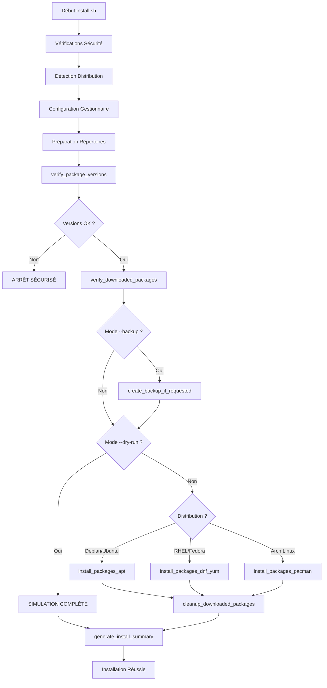

# DOCUMENTATION - INSTALL.SH

## Vue d'Ensemble

**install.sh** est le **script d'installation sécurisée** du système AutoPatch. Il constitue la phase critique d'exécution qui installe **exclusivement** les paquets téléchargés par `download.sh`, avec une vérification stricte des versions pour garantir qu'aucune version non autorisée ne peut être installée.

## Mission et Responsabilités Critiques

### Gardien de l'Installation Sécurisée
- **Vérification stricte** : Contrôle absolu des versions autorisées via `locked_versions.txt`
- **Installation exclusive** : Utilise UNIQUEMENT les paquets téléchargés préalablement
- **Sauvegardes préventives** : Création optionnelle de points de restauration
- **Traçabilité complète** : Documentation détaillée de chaque installation

### Mécanisme de Sécurité Renforcée
- **Aucun téléchargement** : Ne télécharge JAMAIS de nouveaux paquets
- **Refus automatique** : Bloque toute version non verrouillée
- **Mode simulation** : Test complet sans modification système
- **Rollback intégré** : Sauvegarde automatique avant installation

## Architecture de Sécurité

### Structure de Sécurité Multi-Niveaux

```bash
install.sh
├── FONCTIONS UTILITAIRES SÉCURISÉES
│   ├── log_message()              # Logging avec horodatage précis
│   ├── show_help()                # Documentation sécurité intégrée
│   ├── check_root()               # Vérification privilèges obligatoire
│   ├── create_lock()              # Anti-collision processus
│   └── cleanup_on_exit()          # Nettoyage sécurisé interruptions
│
├── DÉTECTION ET CONFIGURATION
│   ├── detect_distribution()      # Auto-détection système fiable
│   ├── configure_package_manager() # Configuration gestionnaire adapté
│   └── prepare_directories()       # Structure répertoires sécurisée
│
├── VÉRIFICATIONS DE SÉCURITÉ CRITIQUES
│   ├── verify_package_versions()  # CONTRÔLE VERSIONS VERROUILLÉES
│   │   ├── Lecture locked_versions.txt (format sécurisé)
│   │   ├── Comparaison exacte version par version
│   │   ├── Rejet automatique versions non autorisées
│   │   └── Logging détaillé des vérifications
│   ├── verify_downloaded_packages() # Validation paquets présents
│   │   ├── Vérification existence fichiers
│   │   ├── Contrôle intégrité paquets
│   │   └── Mapping paquets ↔ versions verrouillées
│   └── create_backup_if_requested() # Sauvegarde préventive
│
├── INSTALLATION PAR GESTIONNAIRE
│   ├── install_packages_apt()     # Installation sécurisée APT
│   │   ├── dpkg --install *.deb   # Installation locale uniquement
│   │   ├── apt-get -f install     # Résolution dépendances locales
│   │   └── Vérification post-installation
│   ├── install_packages_dnf_yum() # Installation sécurisée RPM
│   │   ├── dnf/yum localinstall *.rpm # Installation fichiers locaux
│   │   ├── Résolution dépendances contrôlée
│   │   └── Validation post-installation
│   └── install_packages_pacman()  # Installation sécurisée Pacman
│       ├── pacman -U *.pkg.tar.* # Installation paquets locaux
│       ├── Gestion conflits automatique
│       └── Vérification cohérence système
│
├── GESTION DES SAUVEGARDES
│   ├── create_backup_apt()        # Sauvegarde état APT complet
│   ├── create_backup_dnf_yum()    # Sauvegarde état RPM complet
│   ├── create_backup_pacman()     # Sauvegarde état Pacman complet
│   └── backup_metadata_generation() # Métadonnées sauvegarde
│
├── MAINTENANCE ET NETTOYAGE
│   ├── cleanup_downloaded_packages() # Nettoyage post-installation
│   └── generate_install_summary()    # Rapport installation détaillé
│
└── ORCHESTRATION SÉCURISÉE
    ├── install_packages()        # Fonction principale installation
    └── main()                    # Point d'entrée avec vérifications
```

## Mécanisme de Sécurité des Versions

### Contrôle Strict des Versions Autorisées

Le cœur de la sécurité repose sur la fonction `verify_package_versions()` :

```bash
verify_package_versions() {
    log_message "INFO" "VÉRIFICATION DE SÉCURITÉ : Contrôle des versions autorisées"
    
    # 1. VÉRIFICATION EXISTENCE FICHIERS DE CONTRÔLE
    if [[ ! -f "$PACKAGES_LOG" ]]; then
        log_message "ERROR" "SÉCURITÉ : Fichier packages_to_install.log manquant"
        echo "ERREUR SÉCURITÉ : Exécutez d'abord download.sh" >&2
        return 1
    fi
    
    if [[ ! -f "$LOCKED_VERSIONS" ]]; then
        log_message "ERROR" "SÉCURITÉ : Fichier locked_versions.txt manquant" 
        echo "ERREUR SÉCURITÉ : Fichier de versions verrouillées absent" >&2
        return 1
    fi
    
    # 2. VÉRIFICATION VERSION PAR VERSION
    local version_mismatch=false
    
    # Scan de tous les paquets téléchargés
    case "$PACKAGE_MANAGER" in
        apt)
            verify_apt_versions
            ;;
        dnf|yum)
            verify_rpm_versions  
            ;;
        pacman)
            verify_pacman_versions
            ;;
    esac
    
    # 3. DÉCISION FINALE SÉCURISÉE
    if [[ "$version_mismatch" == "true" ]]; then
        log_message "ERROR" "SÉCURITÉ COMPROMISE : Versions non autorisées détectées!"
        log_message "ERROR" "INSTALLATION REFUSÉE pour protection système"
        echo "ERREUR DE SÉCURITÉ CRITIQUE :" >&2
        echo "   Des paquets avec versions non autorisées ont été détectés." >&2
        echo "   Ces versions ne correspondent pas aux versions verrouillées." >&2
        echo "   INSTALLATION BLOQUÉE pour votre sécurité." >&2
        return 1
    fi
    
    log_message "INFO" "SÉCURITÉ VALIDÉE : Toutes les versions sont conformes"
    return 0
}
```

### Vérification par Gestionnaire de Paquets

#### **Vérification APT (Debian/Ubuntu)**

```bash
verify_apt_versions() {
    log_message "INFO" "Vérification des versions APT/DEB..."
    
    # Scan tous les fichiers .deb téléchargés
    local package_files=$(find "$DOWNLOAD_DIR" -name "*.deb" 2>/dev/null)
    
    for package_file in $package_files; do
        if [[ -f "$package_file" ]]; then
            # Extraction métadonnées paquet
            local package_info=$(dpkg --info "$package_file" | grep "Package:\|Version:")
            local package_name=$(echo "$package_info" | grep "Package:" | cut -d' ' -f2)
            local package_version=$(echo "$package_info" | grep "Version:" | cut -d' ' -f2)
            
            # CONTRÔLE CRITIQUE : Vérification dans locked_versions.txt
            if ! grep -q "^$package_name=$package_version$" "$LOCKED_VERSIONS"; then
                log_message "ERROR" "VERSION NON AUTORISÉE : $package_name=$package_version"
                log_message "ERROR" "   Cette version n'est pas dans les versions verrouillées"
                version_mismatch=true
            else
                log_message "INFO" "Version autorisée confirmée : $package_name=$package_version"
            fi
        fi
    done
}
```

#### **Vérification RPM (RHEL/Fedora)**

```bash
verify_rpm_versions() {
    log_message "INFO" "Vérification des versions RPM..."
    
    # Scan tous les fichiers .rpm téléchargés
    local package_files=$(find "$DOWNLOAD_DIR" -name "*.rpm" 2>/dev/null)
    
    for package_file in $package_files; do
        if [[ -f "$package_file" ]]; then
            # Extraction métadonnées RPM
            local package_info=$(rpm -qp "$package_file" --queryformat "%{NAME} %{VERSION}-%{RELEASE}" 2>/dev/null)
            local package_name=$(echo "$package_info" | cut -d' ' -f1)
            local package_version=$(echo "$package_info" | cut -d' ' -f2)
            
            # CONTRÔLE CRITIQUE : Format RPM name=version-release
            local expected_format="${package_name}=${package_version}"
            if ! grep -q "^$expected_format" "$LOCKED_VERSIONS"; then
                log_message "ERROR" "VERSION NON AUTORISÉE : $expected_format"
                version_mismatch=true
            else
                log_message "INFO" "Version autorisée confirmée : $expected_format"
            fi
        fi
    done
}
```

#### **Vérification Pacman (Arch Linux)**

```bash
verify_pacman_versions() {
    log_message "INFO" "Vérification des versions Pacman..."
    
    # Scan tous les fichiers .pkg.tar.* téléchargés
    local package_files=$(find "$DOWNLOAD_DIR" -name "*.pkg.tar.*" 2>/dev/null)
    
    for package_file in $package_files; do
        if [[ -f "$package_file" ]]; then
            # Extraction info paquet Pacman
            local package_info=$(pacman -Qp "$package_file" 2>/dev/null)
            local package_name=$(echo "$package_info" | cut -d' ' -f1)
            local package_version=$(echo "$package_info" | cut -d' ' -f2)
            
            # CONTRÔLE CRITIQUE : Vérification version Pacman
            if ! grep -q "^$package_name=$package_version$" "$LOCKED_VERSIONS"; then
                log_message "ERROR" "VERSION NON AUTORISÉE : $package_name=$package_version"
                version_mismatch=true
            else
                log_message "INFO" "Version autorisée confirmée : $package_name=$package_version"
            fi
        fi
    done
}
```

## Processus d'Installation Sécurisée

### Workflow d'Installation Complète



### Mode Dry-Run (Simulation Complète)

Le mode `--dry-run` permet une simulation complète sans modification système :

```bash
if [[ "$DRY_RUN" == "true" ]]; then
    echo "MODE SIMULATION ACTIVÉ - Aucune modification système"
    echo "══════════════════════════════════════════════════════════"
    
    echo "PAQUETS QUI SERAIENT INSTALLÉS :"
    case "$PACKAGE_MANAGER" in
        apt)
            find "$DOWNLOAD_DIR" -name "*.deb" | while read -r deb_file; do
                local info=$(dpkg --info "$deb_file" | grep "Package:\|Version:")
                echo "   $(echo "$info" | grep Package: | cut -d' ' -f2) version $(echo "$info" | grep Version: | cut -d' ' -f2)"
            done
            ;;
        dnf|yum)
            find "$DOWNLOAD_DIR" -name "*.rpm" | while read -r rpm_file; do
                echo "   $(rpm -qp "$rpm_file" 2>/dev/null)"
            done
            ;;
        pacman)
            find "$DOWNLOAD_DIR" -name "*.pkg.tar.*" | while read -r pkg_file; do
                echo "   $(pacman -Qp "$pkg_file" 2>/dev/null)"
            done
            ;;
    esac
    
    echo "══════════════════════════════════════════════════════════"
    echo "Simulation terminée - Aucun paquet installé réellement"
    return 0
fi
```

## Installation par Gestionnaire de Paquets

### Installation APT (Debian/Ubuntu)

```bash
install_packages_apt() {
    log_message "INFO" "Début de l'installation des paquets via APT (installation locale)"
    
    # Vérification présence paquets .deb
    local deb_files=$(find "$DOWNLOAD_DIR" -name "*.deb" 2>/dev/null)
    if [[ -z "$deb_files" ]]; then
        log_message "ERROR" "Aucun paquet .deb trouvé dans $DOWNLOAD_DIR"
        return 2
    fi
    
    local package_count=$(echo "$deb_files" | wc -l)
    log_message "INFO" "Installation de $package_count paquet(s) .deb"
    
    # INSTALLATION LOCALE SÉCURISÉE - Aucun téléchargement
    if ! dpkg --install $deb_files >> "$LOG_FILE" 2>&1; then
        log_message "WARN" "Certains paquets ont des dépendances non satisfaites"
        log_message "INFO" "Résolution automatique des dépendances..."
        
        # Résolution dépendances UNIQUEMENT avec paquets déjà présents
        if ! apt-get -f install --fix-broken >> "$LOG_FILE" 2>&1; then
            log_message "ERROR" "Échec de la résolution des dépendances"
            return 1
        fi
    fi
    
    log_message "INFO" "Installation APT terminée avec succès"
    return 0
}
```

### Installation DNF/YUM (RHEL/Fedora)

```bash
install_packages_dnf_yum() {
    log_message "INFO" "Début de l'installation des paquets via $PACKAGE_MANAGER_CMD (installation locale)"
    
    # Vérification présence paquets .rpm
    local rpm_files=$(find "$DOWNLOAD_DIR" -name "*.rpm" 2>/dev/null)
    if [[ -z "$rpm_files" ]]; then
        log_message "ERROR" "Aucun paquet .rpm trouvé dans $DOWNLOAD_DIR"
        return 2
    fi
    
    local package_count=$(echo "$rpm_files" | wc -l)
    log_message "INFO" "Installation de $package_count paquet(s) .rpm"
    
    # INSTALLATION LOCALE SÉCURISÉE - localinstall uniquement
    if ! $PACKAGE_MANAGER_CMD localinstall -y $rpm_files >> "$LOG_FILE" 2>&1; then
        log_message "ERROR" "Échec de l'installation $PACKAGE_MANAGER_CMD"
        return 1
    fi
    
    log_message "INFO" "Installation $PACKAGE_MANAGER_CMD terminée avec succès"
    return 0
}
```

### Installation Pacman (Arch Linux)

```bash
install_packages_pacman() {
    log_message "INFO" "Début de l'installation des paquets via Pacman (installation locale)"
    
    # Vérification présence paquets .pkg.tar.*
    local pkg_files=$(find "$DOWNLOAD_DIR" -name "*.pkg.tar.*" 2>/dev/null)
    if [[ -z "$pkg_files" ]]; then
        log_message "ERROR" "Aucun paquet .pkg.tar.* trouvé dans $DOWNLOAD_DIR"
        return 2
    fi
    
    local package_count=$(echo "$pkg_files" | wc -l)
    log_message "INFO" "Installation de $package_count paquet(s) Pacman"
    
    # INSTALLATION LOCALE SÉCURISÉE - Upgrade avec paquets locaux
    if ! pacman -U --noconfirm $pkg_files >> "$LOG_FILE" 2>&1; then
        log_message "ERROR" "Échec de l'installation Pacman"
        return 1
    fi
    
    log_message "INFO" "Installation Pacman terminée avec succès"
    return 0
}
```

## Système de Sauvegardes Préventives

### Sauvegarde Complète Avant Installation

Quand `--backup` est spécifié, le script crée une sauvegarde complète du système :

```bash
create_backup_if_requested() {
    if [[ "$CREATE_BACKUP" != "true" ]]; then
        return 0
    fi
    
    log_message "INFO" "Création d'une sauvegarde préventive demandée..."
    
    local backup_name="backup_$(date +%Y%m%d_%H%M%S)"
    local backup_path="${BACKUP_DIR}/${backup_name}"
    
    # Création répertoire sauvegarde
    mkdir -p "$backup_path"
    chmod 755 "$backup_path"
    
    # Sauvegarde spécifique au gestionnaire
    case "$PACKAGE_MANAGER" in
        apt)
            create_backup_apt "$backup_path" "$backup_name"
            ;;
        dnf|yum)
            create_backup_dnf_yum "$backup_path" "$backup_name"
            ;;
        pacman)
            create_backup_pacman "$backup_path" "$backup_name"
            ;;
    esac
    
    # Création lien symbolique vers dernière sauvegarde
    local latest_link="${BACKUP_DIR}/latest"
    if [[ -L "$latest_link" ]]; then
        rm -f "$latest_link"
    fi
    ln -sf "$backup_name" "$latest_link"
    
    log_message "INFO" "Sauvegarde créée avec succès : $backup_path"
    log_message "INFO" "Dernière sauvegarde accessible via : $latest_link"
}
```

### Sauvegarde APT Complète

```bash
create_backup_apt() {
    local backup_path="$1"
    local backup_name="$2"
    
    log_message "INFO" "Sauvegarde APT complète en cours..."
    
    # Liste complète des paquets installés avec versions
    dpkg -l | awk '/^ii/ {print $2 " " $3}' > "${backup_path}/installed_packages.txt"
    
    # Liste simple pour restauration
    dpkg -l | awk '/^ii/ {print $2 "=" $3}' > "${backup_path}/packages_with_versions.txt"
    
    # Sauvegarde configuration APT
    if [[ -d /etc/apt/sources.list.d ]]; then
        cp -r /etc/apt/sources.list.d "${backup_path}/" 2>/dev/null || true
    fi
    cp /etc/apt/sources.list "${backup_path}/" 2>/dev/null || true
    
    # État des paquets en attente (hold)
    dpkg --get-selections > "${backup_path}/package_selections.txt"
    
    # Historique APT
    if [[ -f /var/log/apt/history.log ]]; then
        cp /var/log/apt/history.log "${backup_path}/apt_history.log"
    fi
    
    log_message "INFO" "Sauvegarde APT terminée"
}
```

### Sauvegarde RPM Complète

```bash
create_backup_dnf_yum() {
    local backup_path="$1" 
    local backup_name="$2"
    
    log_message "INFO" "Sauvegarde $PACKAGE_MANAGER_CMD complète en cours..."
    
    # Liste complète des paquets installés
    $PACKAGE_MANAGER_CMD list installed > "${backup_path}/installed_packages.txt" 2>/dev/null
    
    # Liste RPM détaillée avec versions et checksums
    rpm -qa --queryformat "%{NAME}-%{VERSION}-%{RELEASE}.%{ARCH}\n" > "${backup_path}/packages_with_versions.txt"
    
    # Historique des transactions
    $PACKAGE_MANAGER_CMD history list > "${backup_path}/transaction_history.txt" 2>/dev/null || true
    
    # Sauvegarde configuration repositories
    if [[ -d /etc/yum.repos.d ]]; then
        cp -r /etc/yum.repos.d "${backup_path}/" 2>/dev/null || true
    fi
    
    log_message "INFO" "Sauvegarde $PACKAGE_MANAGER_CMD terminée"
}
```

### Sauvegarde Pacman Complète

```bash
create_backup_pacman() {
    local backup_path="$1"
    local backup_name="$2"
    
    log_message "INFO" "Sauvegarde Pacman complète en cours..."
    
    # Liste complète paquets installés avec versions
    pacman -Q > "${backup_path}/installed_packages.txt"
    
    # Paquets installés explicitement (vs dépendances)
    pacman -Qe > "${backup_path}/explicitly_installed.txt"
    
    # Paquets étrangers (AUR, compilés manuellement)
    pacman -Qm > "${backup_path}/foreign_packages.txt"
    
    # Base de données locale Pacman (si possible)
    cp -r /var/lib/pacman/local "${backup_path}/pacman_local_backup" 2>/dev/null || true
    
    # Informations groupes
    pacman -Qg > "${backup_path}/package_groups.txt"
    
    log_message "INFO" "Sauvegarde Pacman terminée"
}
```

## Options et Modes d'Utilisation

### Syntaxe Complète et Options

```bash
sudo ./install.sh [OPTIONS]

OPTIONS PRINCIPALES:
    --backup, -b      Crée une sauvegarde complète avant installation
    --dry-run, -d     Mode simulation (aucune modification système)
    --verbose, -v     Mode verbeux (affichage détails complets)
    --help, -h        Affiche cette aide détaillée

EXEMPLES D'UTILISATION:
    sudo ./install.sh                     # Installation standard sécurisée
    sudo ./install.sh --backup            # Installation + sauvegarde préventive
    sudo ./install.sh --dry-run           # Simulation complète sans installation
    sudo ./install.sh --verbose           # Installation avec détails complets
    sudo ./install.sh -b -v               # Sauvegarde + mode verbeux
    sudo ./install.sh -b -d -v            # Toutes options (simulation avec sauvegarde)
```

### Modes d'Exécution Détaillés

#### **Mode Standard (Défaut)**
```bash
sudo ./install.sh

COMPORTEMENT:
├── Vérification sécurisée des versions verrouillées
├── Installation exclusive des paquets téléchargés  
├── Logging standard des opérations
├── Nettoyage automatique post-installation
└── Résumé basique des opérations
```

#### **Mode Backup (--backup)**
```bash
sudo ./install.sh --backup

COMPORTEMENT SUPPLÉMENTAIRE:
├── + Création sauvegarde complète pré-installation
├── + Métadonnées détaillées de sauvegarde
├── + Lien symbolique vers dernière sauvegarde
├── + Logging des opérations de sauvegarde
└── + Informations rollback dans résumé
```

#### **Mode Dry-Run (--dry-run)**
```bash
sudo ./install.sh --dry-run

SIMULATION COMPLÈTE:
├── Toutes vérifications sécurité (réelles)
├── Affichage détaillé paquets à installer
├── Simulation des étapes d'installation
├── Aucune modification système réelle
└── Résumé complet comme si installé
```

#### **Mode Verbose (--verbose)**
```bash
sudo ./install.sh --verbose

AFFICHAGE DÉTAILLÉ:
├── Détails de chaque vérification sécurité
├── Progression en temps réel installation
├── Affichage des commandes exécutées
├── Détails des opérations de sauvegarde
└── Résumé complet avec statistiques
```

## Nettoyage et Maintenance

### Nettoyage Post-Installation

```bash
cleanup_downloaded_packages() {
    if [[ "$DRY_RUN" == "true" ]]; then
        echo "[SIMULATION] Nettoyage des paquets téléchargés..."
        return 0
    fi
    
    log_message "INFO" "Nettoyage des paquets téléchargés après installation..."
    
    # Suppression paquets par type selon distribution
    case "$PACKAGE_MANAGER" in
        apt)
            find "$DOWNLOAD_DIR" -name "*.deb" -delete 2>/dev/null || true
            ;;
        dnf|yum)
            find "$DOWNLOAD_DIR" -name "*.rpm" -delete 2>/dev/null || true
            ;;
        pacman)
            find "$DOWNLOAD_DIR" -name "*.pkg.tar.*" -delete 2>/dev/null || true
            ;;
    esac
    
    # Conservation des fichiers de contrôle importants
    # locked_versions.txt, packages_to_install.log conservés pour audit
    
    log_message "INFO" "Nettoyage terminé - Fichiers de contrôle conservés"
}
```

### Génération du Résumé d'Installation

```bash
generate_install_summary() {
    local summary_file="${LOG_DIR}/install_summary_$(date +%Y%m%d_%H%M%S).txt"
    local timestamp=$(date '+%Y-%m-%d %H:%M:%S')
    
    {
        echo "═══════════════════════════════════════════════════════════"
        echo "               RÉSUMÉ D'INSTALLATION AUTOPATCH"
        echo "═══════════════════════════════════════════════════════════"
        echo "Date: $timestamp"
        echo "Distribution: $DISTRO"
        echo "Gestionnaire: $PACKAGE_MANAGER"
        echo "Mode dry-run: $DRY_RUN"
        echo "Sauvegarde créée: $CREATE_BACKUP"
        echo "Mode verbeux: $VERBOSE"
        echo ""
        
        # Informations de sauvegarde si créée
        if [[ "$CREATE_BACKUP" == "true" ]] && [[ -L "${BACKUP_DIR}/latest" ]]; then
            echo "=== SAUVEGARDE ==="
            local latest_backup=$(readlink "${BACKUP_DIR}/latest")
            echo "Dernière sauvegarde: $latest_backup"
            echo "Lien d'accès: ${BACKUP_DIR}/latest"
            
            # Taille de la sauvegarde
            local backup_size=$(du -sh "${BACKUP_DIR}/${latest_backup}" 2>/dev/null | cut -f1)
            echo "Taille sauvegarde: $backup_size"
            echo ""
        fi
        
        # Statistiques paquets installés
        echo "=== ÉTAT FINAL DES PAQUETS ==="
        case "$PACKAGE_MANAGER" in
            apt)
                local installed_count=$(dpkg -l | grep "^ii" | wc -l)
                echo "Paquets installés (total): $installed_count"
                ;;
            dnf|yum)
                local installed_count=$($PACKAGE_MANAGER_CMD list installed 2>/dev/null | grep -v "^Installed" | wc -l)
                echo "Paquets installés (total): $installed_count"
                ;;
            pacman)
                local installed_count=$(pacman -Q | wc -l)
                local explicit_count=$(pacman -Qe | wc -l)
                echo "Paquets installés (total): $installed_count"
                echo "Paquets explicites: $explicit_count"
                ;;
        esac
        
        # État espace disque
        echo ""
        echo "=== ESPACE DISQUE ==="
        df -h / | tail -1 | awk '{print "Racine (/) : " $3 " utilisés / " $2 " total (" $5 " plein)"}'
        
        # Logs pour audit
        echo ""
        echo "=== AUDIT ET LOGS ==="
        echo "Log installation: $LOG_FILE"
        echo "Résumé détaillé: $summary_file"
        if [[ -f "$LOCKED_VERSIONS" ]]; then
            echo "Versions verrouillées: $LOCKED_VERSIONS"
        fi
        if [[ -f "$PACKAGES_LOG" ]]; then
            echo "Liste paquets: $PACKAGES_LOG"  
        fi
        
        echo ""
        echo "═══════════════════════════════════════════════════════════"
        if [[ "$DRY_RUN" == "true" ]]; then
            echo "SIMULATION TERMINÉE - Aucune modification réelle effectuée"
        else
            echo "INSTALLATION TERMINÉE AVEC SUCCÈS"
        fi
        echo "═══════════════════════════════════════════════════════════"
        
    } > "$summary_file"
    
    log_message "INFO" "Résumé d'installation généré: $summary_file"
    
    # Affichage résumé en mode verbose
    if [[ "$VERBOSE" == "true" ]]; then
        echo ""
        echo "RÉSUMÉ D'INSTALLATION :"
        cat "$summary_file"
    fi
}
```

## Logging et Monitoring

### Système de Logs Détaillé

```bash
LOG FILE: /var/log/autopatch/install.log

FORMAT STANDARD: [TIMESTAMP] [LEVEL] MESSAGE

EXEMPLES DE LOGS DÉTAILLÉS:
[2024-07-22 16:45:15] [INFO] === DÉBUT DE L'INSTALLATION SÉCURISÉE ===
[2024-07-22 16:45:15] [INFO] Mode backup activé: true
[2024-07-22 16:45:15] [INFO] Mode dry-run: false  
[2024-07-22 16:45:15] [INFO] Mode verbose: true
[2024-07-22 16:45:16] [INFO] Détection de la distribution Linux en cours...
[2024-07-22 16:45:16] [INFO] Distribution détectée: Ubuntu 22.04.3 LTS
[2024-07-22 16:45:16] [INFO] Gestionnaire de paquets: APT
[2024-07-22 16:45:17] [INFO] VÉRIFICATION SÉCURITÉ : Contrôle des versions autorisées
[2024-07-22 16:45:17] [INFO] Fichiers de contrôle détectés et validés
[2024-07-22 16:45:17] [INFO] Vérification des versions APT/DEB...
[2024-07-22 16:45:18] [INFO] Version autorisée confirmée : apache2=2.4.41-4ubuntu3.14
[2024-07-22 16:45:18] [INFO] Version autorisée confirmée : nginx=1.18.0-6ubuntu14.3
[2024-07-22 16:45:18] [INFO] Version autorisée confirmée : mysql-server-8.0=8.0.34-0ubuntu0.22.04.1
[2024-07-22 16:45:19] [INFO] SÉCURITÉ VALIDÉE : Toutes les versions sont conformes
[2024-07-22 16:45:19] [INFO] Création d'une sauvegarde préventive demandée...
[2024-07-22 16:45:19] [INFO] Sauvegarde APT complète en cours...
[2024-07-22 16:45:35] [INFO] Sauvegarde APT terminée
[2024-07-22 16:45:35] [INFO] Sauvegarde créée avec succès : /var/tmp/autopatch_backups/backup_20240722_164535
[2024-07-22 16:45:35] [INFO] Dernière sauvegarde accessible via : /var/tmp/autopatch_backups/latest
[2024-07-22 16:45:36] [INFO] Début de l'installation des paquets via APT (installation locale)
[2024-07-22 16:45:36] [INFO] Installation de 3 paquet(s) .deb
[2024-07-22 16:47:12] [INFO] Installation APT terminée avec succès
[2024-07-22 16:47:12] [INFO] Nettoyage des paquets téléchargés après installation...
[2024-07-22 16:47:13] [INFO] Nettoyage terminé - Fichiers de contrôle conservés
[2024-07-22 16:47:13] [INFO] Résumé d'installation généré: /var/log/autopatch/install_summary_20240722_164713.txt
[2024-07-22 16:47:13] [INFO] === INSTALLATION TERMINÉE AVEC SUCCÈS ===
```

## Sécurité et Gestion d'Erreurs

### Scénarios d'Erreurs et Réponses

#### **Erreur Critique : Version Non Autorisée**
```bash
DÉTECTION:
└── Paquet présent mais version différente de locked_versions.txt

RÉPONSE SÉCURISÉE:
├── Arrêt immédiat installation
├── Logging détaillé de l'anomalie
├── Message d'erreur explicite utilisateur
├── Informations pour diagnostic
└── Code retour 1 (sécurité)

MESSAGE UTILISATEUR:
"ERREUR DE SÉCURITÉ CRITIQUE :
Des paquets avec versions non autorisées ont été détectés.
Ces versions ne correspondent pas aux versions verrouillées.
INSTALLATION BLOQUÉE pour votre sécurité."
```

#### **Erreur : Fichiers de Contrôle Manquants**
```bash
DÉTECTION:
└── locked_versions.txt ou packages_to_install.log absents

RÉPONSE:
├── Arrêt avant toute modification
├── Message clair pour l'utilisateur
├── Instructions de résolution
└── Code retour 1

MESSAGE UTILISATEUR:
"ERREUR SÉCURITÉ : Exécutez d'abord download.sh
Fichiers de contrôle manquants pour installation sécurisée."
```

#### **Erreur : Échec Sauvegarde**
```bash
DÉTECTION:
└── Impossible de créer sauvegarde (espace, permissions, etc.)

RÉPONSE:
├── Logging de l'erreur détaillée
├── Avertissement utilisateur
├── Proposition continuer sans sauvegarde
└── Code retour 3 si critique

COMPORTEMENT:
└── Installation continue SAUF si --backup obligatoire
```

### Codes de Retour Sécurisés

| Code | Signification | Description | Action |
|------|--------------|-------------|--------|
| **0** | Succès complet | Installation réussie | Continue |
| **1** | Erreur sécurité | Version non autorisée/fichiers manquants | Stop |
| **2** | Aucun paquet | Rien à installer | Normal |
| **3** | Échec sauvegarde | Problème création backup | Vérifier |
| **4** | Échec installation | Problème gestionnaire paquets | Debug |

## Intégration Écosystème AutoPatch

### Interface avec download.sh

install.sh dépend entièrement des fichiers générés par download.sh :

```bash
FICHIERS REQUIS DE DOWNLOAD.SH:
├── locked_versions.txt      # CRITIQUE - Versions autorisées
├── packages_to_install.log  # Documentation équipes
├── package_list.txt         # Liste simple
├── *.deb/*.rpm/*.pkg.tar.*  # Paquets téléchargés
└── download_summary.txt     # Résumé opérations

VÉRIFICATIONS AUTOMATIQUES:
├── Existence de tous les fichiers critiques
├── Cohérence versions entre fichiers et paquets
├── Intégrité des paquets téléchargés
└── Correspondance exacte locked_versions ↔ paquets
```

### Interface avec rollback.sh

install.sh prépare les éléments pour rollback.sh :

```bash
ÉLÉMENTS GÉNÉRÉS POUR ROLLBACK:
├── Sauvegardes système complètes (si --backup)
├── Métadonnées détaillées sauvegardes
├── Liens symboliques vers dernière sauvegarde
├── Résumés d'installation pour audit
└── Logs détaillés des opérations

STRUCTURE SAUVEGARDE UTILISÉE PAR ROLLBACK:
/var/tmp/autopatch_backups/
├── backup_YYYYMMDD_HHMMSS/
│   ├── installed_packages.txt
│   ├── packages_with_versions.txt
│   ├── backup_metadata.txt
│   └── [fichiers spécifiques distribution]
└── latest -> backup_le_plus_récent
```

## Bonnes Pratiques et Recommandations

### Utilisation Recommandée

```bash
# 1. Première installation - avec sauvegarde et verbose
sudo ./install.sh --backup --verbose

# 2. Installation de production - avec sauvegarde
sudo ./install.sh --backup

# 3. Test avant déploiement - simulation complète
sudo ./install.sh --dry-run --verbose

# 4. Installation automatisée - via manager
sudo ./autopatch-manager.sh install --backup

# 5. Debug problème - mode verbose + logs
sudo ./install.sh --verbose 2>&1 | tee debug-install.log
```

### Recommandations de Sécurité

```bash
AVANT CHAQUE INSTALLATION:
- Vérifier que download.sh a été exécuté récemment
- Contrôler le contenu de locked_versions.txt
- Vérifier l'espace disque disponible
- S'assurer qu'aucune autre installation n'est en cours
- Prévoir window de maintenance suffisante

SURVEILLANCE POST-INSTALLATION:
- Vérifier les services critiques
- Contrôler les logs système
- Tester les applications métiers
- Valider la connectivité réseau
- Archiver les résumés d'installation
```

### Situations à Éviter

```bash
DANGERS À ÉVITER ABSOLUMENT:
├── Exécuter install.sh sans download.sh préalable
├── Modifier manuellement locked_versions.txt
├── Supprimer les fichiers de contrôle avant installation
├── Forcer installation avec versions incohérentes
├── Ignorer les erreurs de vérification sécurité
└── Exécuter en parallèle avec d'autres gestionnaires paquets
```

---

**Auteur** : DECARNELLE Samuel  
**Version** : 1.0  
**Date** : 2025-07-22

> **install.sh** constitue la barrière de sécurité finale du système AutoPatch, garantissant qu'aucune version non autorisée ne peut compromettre l'intégrité du système, même en cas de tentative de contournement ou d'erreur humaine.
