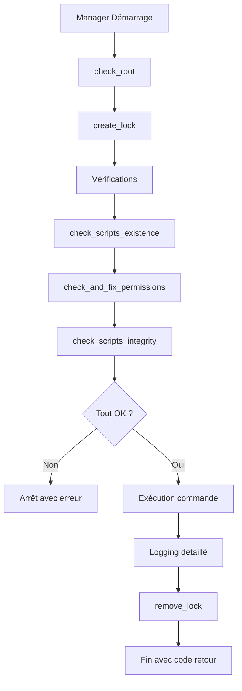

# DOCUMENTATION - AUTOPATCH-MANAGER.SH

## Vue d'Ensemble

**autopatch-manager.sh** est le **script orchestrateur central** du système AutoPatch. Il agit comme une interface unifiée qui coordonne l'exécution de tous les sous-scripts et gère les fonctionnalités avancées comme les démons systemd.

## Rôle et Responsabilités

### Chef d'Orchestre
- **Interface unique** : Point d'entrée central pour toutes les opérations
- **Coordination** : Gestion de l'exécution des 3 sous-scripts
- **Vérification** : Contrôle de l'intégrité et des permissions
- **Configuration** : Gestion des paramètres système et utilisateur

### Gestionnaire d'Automatisation
- **Démons systemd** : Création, configuration et gestion
- **Planification** : Automatisation des tâches récurrentes
- **Monitoring** : Surveillance de l'état du système
- **Maintenance** : Nettoyage et optimisation

## Architecture Fonctionnelle

### Structure Modulaire

```bash
autopatch-manager.sh
├── FONCTIONS UTILITAIRES
│   ├── log_message()           # Logging centralisé
│   ├── check_root()            # Vérification privilèges
│   ├── create_lock()           # Gestion des verrous
│   ├── cleanup_on_exit()       # Nettoyage sécurisé
│   └── show_help()             # Aide contextuelle
│
├── FONCTIONS DE VÉRIFICATION
│   ├── check_scripts_existence()     # Vérification présence scripts
│   ├── check_and_fix_permissions()   # Correction permissions
│   ├── check_scripts_integrity()     # Vérification syntaxe
│   └── setup_system()               # Configuration initiale
│
├── FONCTIONS D'EXÉCUTION
│   ├── execute_download()      # Lancement download.sh
│   ├── execute_install()       # Lancement install.sh
│   ├── execute_rollback()      # Lancement rollback.sh
│   ├── full_update_process()   # Processus complet
│   └── auto_update_process()   # Mise à jour automatisée
│
├── FONCTIONS DE MONITORING
│   ├── show_status()          # Affichage état système
│   └── cleanup_system()       # Nettoyage maintenance
│
├── FONCTIONS DAEMON SYSTEMD
│   ├── configure_daemon()          # Configuration interactive
│   ├── create_systemd_services()   # Création services
│   ├── enable_systemd_daemons()    # Activation démons
│   ├── disable_systemd_daemons()   # Désactivation démons
│   ├── remove_systemd_services()   # Suppression services
│   ├── show_daemon_status()        # Statut démons
│   └── manage_daemon()             # Gestionnaire principal
│
└── FONCTION PRINCIPALE
    └── main()                 # Point d'entrée et orchestration
```

## Commandes et Options

### Commandes Principales

#### **Gestion des Paquets**
```bash
# Téléchargement des paquets
sudo ./autopatch-manager.sh download [--verbose]

# Installation des paquets
sudo ./autopatch-manager.sh install [--backup] [--dry-run] [--verbose]

# Gestion des sauvegardes/rollback
sudo ./autopatch-manager.sh rollback [ACTION] [--verbose]
# Actions: save, list, restore BACKUP_NAME, cleanup, list-versions, restore-version TIMESTAMP
```

#### **Processus Automatisés**
```bash
# Processus complet : téléchargement + installation
sudo ./autopatch-manager.sh full-update [--backup] [--dry-run] [--verbose]

# Mise à jour automatique complète avec sauvegardes
sudo ./autopatch-manager.sh auto-update [--verbose] [--dry-run]
```

#### **Maintenance et Configuration**
```bash
# Configuration initiale du système
sudo ./autopatch-manager.sh setup

# Vérification de l'état du système
sudo ./autopatch-manager.sh status

# Vérification de l'intégrité des scripts
sudo ./autopatch-manager.sh check

# Nettoyage des fichiers temporaires
sudo ./autopatch-manager.sh cleanup
```

#### **Gestion des Démons Systemd**
```bash
# Affichage du statut des démons
sudo ./autopatch-manager.sh daemon status

# Configuration des horaires d'exécution
sudo ./autopatch-manager.sh daemon config

# Création des services systemd
sudo ./autopatch-manager.sh daemon create

# Activation/désactivation des démons
sudo ./autopatch-manager.sh daemon enable
sudo ./autopatch-manager.sh daemon disable

# Suppression complète des services
sudo ./autopatch-manager.sh daemon remove
```

### Options Globales

| Option | Abréviation | Description | Transmission |
|--------|-------------|-------------|--------------|
| `--verbose` | `-v` | Mode verbeux détaillé | Vers sous-scripts |
| `--dry-run` | `-d` | Mode simulation | Vers sous-scripts |
| `--backup` | `-b` | Création de sauvegarde | Vers install.sh |
| `--force` | `-f` | Forçage exécution | Manager uniquement |
| `--help` | `-h` | Affichage de l'aide | Manager uniquement |

## Configuration et Fichiers

### Fichiers de Configuration

#### **/etc/autopatch/manager.conf**
```bash
# Configuration du gestionnaire autopatch

# Options par défaut pour les opérations automatiques
DEFAULT_BACKUP_BEFORE_INSTALL=true
DEFAULT_VERBOSE_MODE=false
DEFAULT_CLEANUP_AFTER_SUCCESS=true

# Rétention des sauvegardes (nombre à conserver)
BACKUP_RETENTION=3

# Planification automatique avec démons systemd
DAEMON_ENABLED=false
DOWNLOAD_DAY="monday"
DOWNLOAD_TIME="02:00"
INSTALL_DAY="wednesday"
INSTALL_TIME="02:30"

# Options pour le démon
DAEMON_VERBOSE=true
DAEMON_BACKUP_BEFORE_INSTALL=true
```

### Répertoires Gérés

```bash
RÉPERTOIRES CRÉÉS ET GÉRÉS :
├── /var/tmp/autopatch_downloads    # Zone de téléchargement
├── /var/tmp/autopatch_backups      # Zone de sauvegarde
├── /var/log/autopatch              # Logs centralisés
├── /etc/autopatch                  # Configuration
└── /var/run/autopatch_*.lock       # Fichiers de verrou
```

## Processus et Workflows

### Workflow de Vérification Pré-Exécution



### Processus Auto-Update Complet

```bash
AUTO-UPDATE WORKFLOW

1. SAUVEGARDE PRÉVENTIVE
   └── execute_rollback save
       ├── Création backup_YYYYMMDD_HHMMSS
       └── Métadonnées complètes

2. TÉLÉCHARGEMENT
   └── execute_download --verbose (si DAEMON_VERBOSE)
       ├── Détection distribution
       ├── Téléchargement paquets
       ├── Génération locked_versions.txt
       └── Archivage historique

3. INSTALLATION SÉCURISÉE
   └── execute_install --backup --verbose
       ├── Vérification versions verrouillées
       ├── Sauvegarde supplémentaire (--backup)
       ├── Installation contrôlée
       └── Génération rapports

4. FINALISATION
   ├── Logging complet des opérations
   ├── Génération résumés
   └── Code de retour détaillé
```

## Gestion des Démons Systemd

### Architecture des Services

Le manager crée automatiquement une infrastructure systemd complète :

#### **Services Générés**

```bash
/etc/systemd/system/
├── autopatch-download.service    # Service téléchargement
├── autopatch-download.timer      # Timer téléchargement
├── autopatch-install.service     # Service installation
└── autopatch-install.timer       # Timer installation
```

#### **Configuration des Services**

**autopatch-download.service**
```ini
[Unit]
Description=AutoPatch Download Service
After=network-online.target
Wants=network-online.target

[Service]
Type=oneshot
User=root
ExecStart=/chemin/vers/autopatch-manager.sh download [--verbose]
StandardOutput=journal
StandardError=journal

[Install]
WantedBy=multi-user.target
```

**autopatch-download.timer**
```ini
[Unit]
Description=AutoPatch Download Timer
Requires=autopatch-download.service

[Timer]
OnCalendar=monday 02:00
Persistent=true
RandomizedDelaySec=300

[Install]
WantedBy=timers.target
```

### Configuration des Horaires

La fonction `configure_daemon()` permet une configuration interactive complète :

```bash
=== CONFIGURATION DES DÉMONS SYSTEMD ===

Configuration actuelle:
  Jour de téléchargement: monday à 02:00
  Jour d'installation: wednesday à 02:30

Nouveau jour de téléchargement [monday]: tuesday
Nouvelle heure de téléchargement (HH:MM) [02:00]: 01:30
Nouveau jour d'installation [wednesday]: friday  
Nouvelle heure d'installation (HH:MM) [02:30]: 03:00

Activer le mode verbeux pour les démons? (O/n): o
Créer une sauvegarde avant chaque installation? (O/n): o

Configuration sauvegardée!
```

### Gestion Avancée des Démons

#### **Monitoring des Services**
```bash
sudo ./autopatch-manager.sh daemon status

=== STATUT DES DÉMONS SYSTEMD ===

Configuration:
  Téléchargement: monday à 02:00
  Installation: wednesday à 02:30
  Démons activés: true

Services systemd:
  autopatch-download.service: [OK] Présent (inactive)
  autopatch-download.timer:   [OK] Présent (enabled, active)
  autopatch-install.service:  [OK] Présent (inactive) 
  autopatch-install.timer:    [OK] Présent (enabled, active)

Prochaines exécutions programmées:
  Téléchargement:
    NEXT                        LEFT       LAST PASSED UNIT ACTIVATES
    Mon 2024-07-29 02:00:00     5 days     n/a  n/a    autopatch-download.timer

  Installation:
    Wed 2024-07-31 02:30:00     1 week     n/a  n/a    autopatch-install.timer
```

#### **Cycle de Vie des Services**
```bash
# Création complète
sudo ./autopatch-manager.sh daemon create
sudo ./autopatch-manager.sh daemon enable

# Gestion fine
systemctl status autopatch-download.timer
systemctl list-timers autopatch-*
journalctl -u autopatch-download.service

# Suppression propre
sudo ./autopatch-manager.sh daemon disable
sudo ./autopatch-manager.sh daemon remove
```

## Logging et Monitoring

### Système de Logs Centralisé

```bash
LOG CENTRALISÉ : /var/log/autopatch/manager.log

FORMAT STANDARD :
[TIMESTAMP] [MANAGER] [LEVEL] MESSAGE

NIVEAUX DE GRAVITÉ :
├── INFO  : Opérations normales
├── WARN  : Avertissements non critiques  
├── ERROR : Erreurs nécessitant attention
└── DEBUG : Détails techniques (mode verbose)
```

### Exemples de Logs

```bash
[2024-07-22 14:30:15] [MANAGER] [INFO] === DÉBUT DU GESTIONNAIRE AUTOPATCH ===
[2024-07-22 14:30:15] [MANAGER] [INFO] Gestionnaire: autopatch-manager.sh
[2024-07-22 14:30:15] [MANAGER] [INFO] PID: 12345
[2024-07-22 14:30:15] [MANAGER] [INFO] Commande: full-update
[2024-07-22 14:30:15] [MANAGER] [INFO] Arguments: --backup --verbose
[2024-07-22 14:30:15] [MANAGER] [INFO] Mode verbeux: true
[2024-07-22 14:30:16] [MANAGER] [INFO] Vérification de l'existence des scripts...
[2024-07-22 14:30:16] [MANAGER] [INFO] Tous les scripts sont présents
[2024-07-22 14:30:16] [MANAGER] [INFO] Permissions OK: download.sh
[2024-07-22 14:30:16] [MANAGER] [INFO] Lancement du script de téléchargement avec arguments: --verbose
[2024-07-22 14:32:45] [MANAGER] [INFO] Script de téléchargement terminé avec succès
[2024-07-22 14:32:45] [MANAGER] [INFO] Lancement du script d'installation avec arguments: --backup --verbose
[2024-07-22 14:35:12] [MANAGER] [INFO] Script d'installation terminé avec succès
[2024-07-22 14:35:12] [MANAGER] [INFO] === GESTIONNAIRE TERMINÉ AVEC SUCCÈS ===
```

### Commande Status Détaillée

```bash
sudo ./autopatch-manager.sh status

=== STATUT DU SYSTÈME AUTOPATCH ===

Date: Mon Jul 22 14:30:00 CEST 2024
Gestionnaire: autopatch-manager.sh
Répertoire des scripts: /home/user/autopatch
Répertoire des logs: /var/log/autopatch

=== ÉTAT DES SCRIPTS ===
download.sh     [OK] Présent et exécutable
install.sh      [OK] Présent et exécutable  
rollback.sh     [OK] Présent et exécutable

=== ÉTAT DES RÉPERTOIRES ===
Téléchargements [OK] Présent (taille: 245M)
Sauvegardes     [OK] Présent (taille: 1.2G)
Logs           [OK] Présent (taille: 12M)
Configuration  [OK] Présent (taille: 4.0K)

=== DERNIÈRES ACTIVITÉS ===
Dernières entrées du log:
  [2024-07-22 14:25:12] [MANAGER] [INFO] Script d'installation terminé avec succès
  [2024-07-22 14:25:12] [MANAGER] [INFO] === GESTIONNAIRE TERMINÉ AVEC SUCCÈS ===

=== SAUVEGARDES DISPONIBLES ===
Nombre de sauvegardes: 3
Dernière sauvegarde: backup_20240722_142500

=== DÉMONS SYSTEMD ===
Configuration automatisation:
  Démons activés: true
  Téléchargement: monday à 02:00
  Installation: wednesday à 02:30
  Services systemd présents: 2/2
```

## Sécurité et Verrous

### Système de Verrous

Le manager implémente un système de verrous robuste pour éviter les exécutions simultanées :

```bash
GESTION DES VERROUS

1. CRÉATION DU VERROU
   ├── Vérification verrou existant
   ├── Test processus actif (kill -0)
   ├── Nettoyage verrous orphelins
   └── Création nouveau verrou (PID)

2. GESTION DES CONFLITS
   ├── Si processus actif → Erreur + exit
   ├── Si --force activé → Suppression forcée
   └── Logging détaillé des actions

3. NETTOYAGE AUTOMATIQUE
   ├── Gestionnaire de signaux (SIGINT, SIGTERM)
   ├── Fonction cleanup_on_exit()
   └── Suppression garantie du verrou
```

### Vérifications de Sécurité

```bash
VÉRIFICATIONS AUTOMATIQUES

check_scripts_existence()
   ├── Vérification présence download.sh
   ├── Vérification présence install.sh  
   ├── Vérification présence rollback.sh
   └── Erreur si script manquant

check_and_fix_permissions()
   ├── Test exécutabilité de chaque script
   ├── Correction automatique (chmod +x)
   ├── Logging des corrections
   └── Erreur si correction impossible

check_scripts_integrity()
   ├── Vérification shebang bash
   ├── Test syntaxe (bash -n)
   ├── Validation structure
   └── Erreur si corruption détectée
```

## Personnalisation et Extension

### Variables de Configuration

Le manager utilise des constantes pour faciliter la maintenance :

```bash
# Configuration globale
readonly SCRIPT_NAME="$(basename "$0")"
readonly SCRIPT_DIR="$(dirname "$(readlink -f "$0")")"
readonly LOG_DIR="/var/log/autopatch"
readonly LOG_FILE="${LOG_DIR}/manager.log"
readonly LOCK_FILE="/var/run/autopatch_manager.lock"
readonly CONFIG_FILE="/etc/autopatch/manager.conf"

# Scripts gérés
readonly DOWNLOAD_SCRIPT="${SCRIPT_DIR}/autopatch-scripts/download.sh"
readonly INSTALL_SCRIPT="${SCRIPT_DIR}/autopatch-scripts/install.sh"  
readonly ROLLBACK_SCRIPT="${SCRIPT_DIR}/autopatch-scripts/rollback.sh"
```

### Points d'Extension

```bash
EXTENSIBILITÉ DU MANAGER

Nouvelles Commandes
   └── Ajouter dans main() case statement

Nouveaux Scripts  
   ├── Ajouter constantes readonly
   ├── Créer fonction execute_*()
   └── Intégrer dans check_scripts_*()

Nouveaux Services Systemd
   ├── Étendre create_systemd_services()
   ├── Mettre à jour show_daemon_status()
   └── Modifier manage_daemon()

Nouvelles Métriques Status
   └── Étendre show_status()
```

## Débogage et Maintenance

### Diagnostics

```bash
# Vérification complète du système
sudo ./autopatch-manager.sh check

# Mode verbeux pour débogage
sudo ./autopatch-manager.sh --verbose [COMMAND]

# Status détaillé
sudo ./autopatch-manager.sh status

# Logs temps réel
sudo tail -f /var/log/autopatch/manager.log
```

### Maintenance

```bash
# Nettoyage automatique
sudo ./autopatch-manager.sh cleanup

# Vérification services systemd
sudo ./autopatch-manager.sh daemon status
systemctl list-timers autopatch-*

# Rechargement configuration
sudo systemctl daemon-reload
```

### Problèmes Courants et Solutions

| Problème | Cause Probable | Solution |
|----------|---------------|----------|
| **Script non trouvé** | Mauvaise installation | `check_scripts_existence()` |
| **Permission refusée** | Scripts non exécutables | `check_and_fix_permissions()` |
| **Verrou bloquant** | Processus zombie | `--force` ou nettoyage manuel |
| **Service non créé** | Erreur systemd | Vérifier `/etc/systemd/system/` |
| **Timer inactif** | Configuration incorrecte | `daemon disable` puis `enable` |

## Codes de Retour

| Code | Signification | Contexte |
|------|--------------|----------|
| **0** | Succès complet | Toutes opérations |
| **1** | Erreur générale | Problème script/config |
| **2** | Script(s) manquant(s) | Problème installation |
| **3** | Erreur de permission | Problème chmod/sudo |
| **4** | Échec de l'opération | Sous-script en erreur |
| **5** | Opération annulée | Utilisateur ou sécurité |
| **6** | Configuration invalide | Paramètres daemon |

---

## Exemples d'Utilisation Avancée

### Workflow Entreprise Complet

```bash
# 1. Configuration initiale nouvelle machine
sudo ./autopatch-manager.sh setup

# 2. Configuration automatisation  
sudo ./autopatch-manager.sh daemon config
sudo ./autopatch-manager.sh daemon create
sudo ./autopatch-manager.sh daemon enable

# 3. Test premier cycle complet
sudo ./autopatch-manager.sh auto-update --verbose

# 4. Monitoring continu
sudo ./autopatch-manager.sh status
sudo ./autopatch-manager.sh daemon status
```

### Gestion d'Urgence

```bash
# Arrêt d'urgence de l'automatisation
sudo ./autopatch-manager.sh daemon disable

# Rollback d'urgence après problème
sudo ./autopatch-manager.sh rollback

# Forçage exécution malgré verrou
sudo ./autopatch-manager.sh --force install --backup

# Diagnostic complet après incident
sudo ./autopatch-manager.sh check
sudo ./autopatch-manager.sh status
```

---

**Auteur** : DECARNELLE Samuel  
**Version** : 1.0  
**Date** : 2025-07-22

> **Le manager** est conçu pour être l'interface unique et sécurisée pour toutes les opérations AutoPatch, de l'utilisation quotidienne à l'automatisation complète en entreprise.
