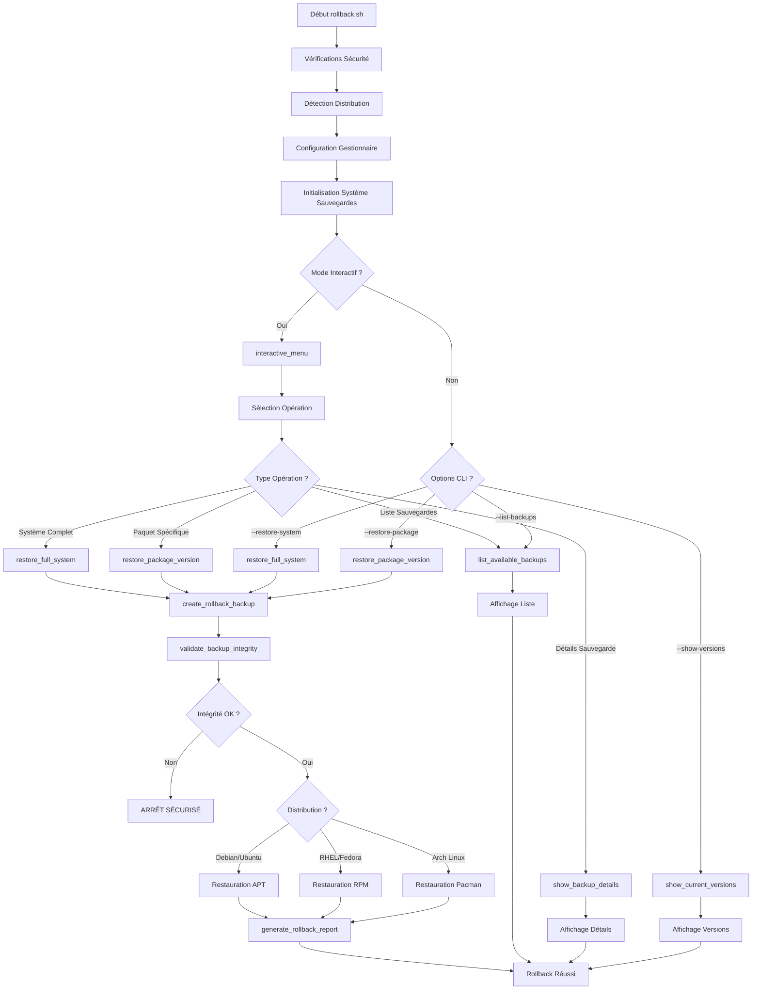

# DOCUMENTATION - ROLLBACK.SH

## Vue d'Ensemble

# DOCUMENTATION - ROLLBACK.SH

## Vue d'Ensemble

**rollback.sh** est le **script de restauration et gestion des sauvegardes** du système AutoPatch. Il constitue le pilier de sécurité permettant la restauration complète du système en cas de problème après installation de mises à jour.

## Mission et Responsabilités Critiques

### Gardien de la Continuité Système

## Mission et Responsabilités Critiques

### Gardien de la Continuité Système
- **Restauration système** : Retour à un état stable antérieur via sauvegardes
- **Gestion versions** : Contrôle granulaire des versions de paquets
- **Interface interactive** : Menu intuitif pour opérations de restauration
- **Audit complet** : Historique détaillé de toutes les opérations

### Capacités de Récupération Multi-Niveaux
- **Rollback complet** : Restauration de l'ensemble du système
- **Rollback sélectif** : Restauration de paquets spécifiques
- **Gestion historique** : Navigation dans l'historique des sauvegardes
- **Mode urgence** : Procédures de récupération d'urgence

## Architecture de Restauration

### Structure de Gestion Multi-Niveaux

```bash
rollback.sh
├── FONCTIONS UTILITAIRES CRITIQUES
│   ├── log_message()              # Logging avec criticité rollback
│   ├── show_help()                # Documentation restauration complète
│   ├── check_root()               # Privilèges obligatoires sécurité
│   ├── create_lock()              # Anti-collision opérations critiques
│   └── cleanup_on_exit()          # Nettoyage sécurisé interruptions
│
├── DÉTECTION ET CONFIGURATION
│   ├── detect_distribution()      # Auto-détection système fiable
│   ├── configure_package_manager() # Configuration gestionnaire adapté
│   └── initialize_backup_system()  # Initialisation système sauvegardes
│
├── GESTION DES SAUVEGARDES SYSTÈME
│   ├── list_available_backups()   # INVENTAIRE SAUVEGARDES DISPONIBLES
│   │   ├── Scan /var/tmp/autopatch_backups/
│   │   ├── Validation intégrité sauvegardes
│   │   ├── Extraction métadonnées temporelles
│   │   └── Classement chronologique
│   ├── validate_backup_integrity() # Vérification intégrité sauvegarde
│   │   ├── Contrôle fichiers métadonnées
│   │   ├── Validation format données
│   │   ├── Vérification cohérence
│   │   └── Test accessibilité fichiers
│   ├── show_backup_details()      # Affichage détaillé sauvegarde
│   │   ├── Informations temporelles
│   │   ├── Contenu paquet sauvegardé
│   │   ├── Taille et statistiques
│   │   └── État de compatibilité
│   └── restore_full_system()      # RESTAURATION SYSTÈME COMPLÈTE
│
├── GESTION GRANULAIRE DES PAQUETS
│   ├── list_package_versions()    # HISTORIQUE VERSIONS PAQUETS
│   │   ├── Scan versions disponibles par paquet
│   │   ├── Extraction historique installations
│   │   ├── Identification versions actuelles
│   │   └── Mapping sources disponibles
│   ├── show_current_versions()    # État actuel versions système
│   │   ├── Paquets installés avec versions
│   │   ├── Dates d'installation
│   │   ├── Sources d'installation
│   │   └── Statut hold/freeze
│   ├── restore_package_version()  # RESTAURATION PAQUET SPÉCIFIQUE
│   │   ├── Téléchargement version cible
│   │   ├── Résolution dépendances
│   │   ├── Installation contrôlée
│   │   └── Vérification post-installation
│   └── restore_multiple_packages() # Restauration lot de paquets
│
├── INTERFACE INTERACTIVE AVANCÉE
│   ├── interactive_menu()         # MENU PRINCIPAL INTERACTIF
│   │   ├── Liste des options disponibles
│   │   ├── Navigation intuitive
│   │   ├── Validation des choix
│   │   └── Gestion des erreurs
│   ├── interactive_backup_selection() # Sélection sauvegarde interactive
│   ├── interactive_package_selection() # Sélection paquets interactive
│   └── interactive_confirm_operations() # Confirmations sécurisées
│
├── SAUVEGARDES PRÉVENTIVES ROLLBACK
│   ├── create_rollback_backup()   # Sauvegarde avant rollback
│   ├── backup_current_state()     # État actuel avant modification
│   └── manage_backup_retention()   # Gestion rétention sauvegardes
│
├── AUDIT ET HISTORIQUE
│   ├── log_rollback_operation()   # Enregistrement opérations rollback
│   ├── generate_rollback_report() # Rapport détaillé opérations
│   ├── track_package_changes()    # Suivi modifications paquets
│   └── maintain_operation_history() # Maintenance historique
│
├── MODES SPÉCIAUX ET UTILITAIRES
│   ├── dry_run_restore()          # Simulation restauration
│   ├── emergency_restore()        # Mode restauration d'urgence
│   ├── verify_system_consistency() # Vérification cohérence système
│   └── cleanup_old_backups()      # Nettoyage sauvegardes anciennes
│
└── ORCHESTRATION ROLLBACK
    ├── rollback_main()            # Fonction principale rollback
    └── main()                     # Point d'entrée avec sécurités
```

## Système de Restauration Multi-Niveaux

### Architecture de Restauration Complète



### Inventaire et Gestion des Sauvegardes

#### **Liste des Sauvegardes Disponibles**

```bash
list_available_backups() {
    log_message "INFO" "Inventaire des sauvegardes disponibles..."
    
    local backup_dir="/var/tmp/autopatch_backups"
    
    if [[ ! -d "$backup_dir" ]]; then
        log_message "ERROR" "Répertoire de sauvegardes introuvable: $backup_dir"
        echo "Aucun répertoire de sauvegardes trouvé"
        echo "   Exécutez d'abord install.sh --backup pour créer des sauvegardes"
        return 1
    fi
    
    # Recherche des sauvegardes avec validation
    local backup_count=0
    local backup_list=()
    
    echo "SAUVEGARDES DISPONIBLES :"
    echo "═══════════════════════════════════════════════════════════"
    
    for backup_path in "$backup_dir"/backup_*; do
        if [[ -d "$backup_path" ]]; then
            local backup_name=$(basename "$backup_path")
            
            # Validation de l'intégrité de la sauvegarde
            if validate_backup_integrity "$backup_path"; then
                backup_count=$((backup_count + 1))
                backup_list+=("$backup_name")
                
                # Extraction des informations temporelles
                local backup_date=$(echo "$backup_name" | sed 's/backup_//; s/_/ /g; s/\(....\)\(..\)\(..\) \(..\)\(..\)\(..\)/\1-\2-\3 \4:\5:\6/')
                
                # Informations détaillées de la sauvegarde
                local backup_size=$(du -sh "$backup_path" 2>/dev/null | cut -f1)
                local package_count=0
                
                if [[ -f "$backup_path/installed_packages.txt" ]]; then
                    case "$PACKAGE_MANAGER" in
                        apt)
                            package_count=$(wc -l < "$backup_path/installed_packages.txt")
                            ;;
                        dnf|yum)
                            package_count=$(grep -c "^" "$backup_path/installed_packages.txt" 2>/dev/null || echo "N/A")
                            ;;
                        pacman)
                            package_count=$(wc -l < "$backup_path/installed_packages.txt")
                            ;;
                    esac
                fi
                
                # Affichage formaté
                printf "%s\n" "$backup_name"
                printf "   Date: %s\n" "$backup_date"
                printf "   Taille: %s\n" "$backup_size"
                printf "   Paquets: %s\n" "$package_count"
                
                # Identification si c'est la dernière sauvegarde
                if [[ -L "$backup_dir/latest" ]] && [[ "$(readlink "$backup_dir/latest")" == "$backup_name" ]]; then
                    printf "   DERNIÈRE SAUVEGARDE\n"
                fi
                
                echo ""
            else
                log_message "WARN" "Sauvegarde corrompue ignorée: $backup_name"
            fi
        fi
    done
    
    echo "═══════════════════════════════════════════════════════════"
    echo "Total: $backup_count sauvegarde(s) disponible(s)"
    
    if [[ $backup_count -eq 0 ]]; then
        echo ""
        echo "CONSEIL: Créez des sauvegardes avec:"
        echo "   sudo ./install.sh --backup"
        return 1
    fi
    
    return 0
}
```

#### **Validation d'Intégrité des Sauvegardes**

```bash
validate_backup_integrity() {
    local backup_path="$1"
    
    # Vérification existence répertoire
    if [[ ! -d "$backup_path" ]]; then
        return 1
    fi
    
    # Vérification fichiers critiques selon gestionnaire
    case "$PACKAGE_MANAGER" in
        apt)
            [[ -f "$backup_path/installed_packages.txt" ]] && \
            [[ -f "$backup_path/packages_with_versions.txt" ]]
            ;;
        dnf|yum)
            [[ -f "$backup_path/installed_packages.txt" ]] && \
            [[ -f "$backup_path/packages_with_versions.txt" ]]
            ;;
        pacman)
            [[ -f "$backup_path/installed_packages.txt" ]] && \
            [[ -f "$backup_path/explicitly_installed.txt" ]]
            ;;
    esac
    
    local integrity_result=$?
    
    if [[ $integrity_result -eq 0 ]]; then
        log_message "INFO" "Intégrité validée: $(basename "$backup_path")"
    else
        log_message "ERROR" "Intégrité compromise: $(basename "$backup_path")"
    fi
    
    return $integrity_result
}
```

#### **Détails de Sauvegarde**

```bash
show_backup_details() {
    local backup_name="$1"
    local backup_path="/var/tmp/autopatch_backups/$backup_name"
    
    if [[ ! -d "$backup_path" ]]; then
        echo "Sauvegarde introuvable: $backup_name"
        return 1
    fi
    
    if ! validate_backup_integrity "$backup_path"; then
        echo "Sauvegarde corrompue: $backup_name"
        return 1
    fi
    
    echo "═══════════════════════════════════════════════════════════"
    echo "             DÉTAILS SAUVEGARDE : $backup_name"
    echo "═══════════════════════════════════════════════════════════"
    
    # Informations temporelles
    local backup_date=$(echo "$backup_name" | sed 's/backup_//; s/_/ /g; s/\(....\)\(..\)\(..\) \(..\)\(..\)\(..\)/\1-\2-\3 \4:\5:\6/')
    echo "Date de création: $backup_date"
    
    # Informations système
    echo "Distribution: $DISTRO"
    echo "Gestionnaire: $PACKAGE_MANAGER"
    
    # Taille et contenu
    local backup_size=$(du -sh "$backup_path" | cut -f1)
    echo "Taille totale: $backup_size"
    
    # Détails par gestionnaire
    case "$PACKAGE_MANAGER" in
        apt)
            show_apt_backup_details "$backup_path"
            ;;
        dnf|yum)
            show_rpm_backup_details "$backup_path" 
            ;;
        pacman)
            show_pacman_backup_details "$backup_path"
            ;;
    esac
    
    echo "═══════════════════════════════════════════════════════════"
}

show_apt_backup_details() {
    local backup_path="$1"
    
    echo ""
    echo "=== CONTENU SAUVEGARDE APT ==="
    
    if [[ -f "$backup_path/installed_packages.txt" ]]; then
        local package_count=$(wc -l < "$backup_path/installed_packages.txt")
        echo "Paquets installés: $package_count"
    fi
    
    if [[ -f "$backup_path/package_selections.txt" ]]; then
        local held_packages=$(grep -c "hold" "$backup_path/package_selections.txt" 2>/dev/null || echo "0")
        echo "Paquets verrouillés: $held_packages"
    fi
    
    if [[ -f "$backup_path/sources.list" ]]; then
        echo "Configuration sources APT: Sauvegardée"
    fi
    
    if [[ -d "$backup_path/sources.list.d" ]]; then
        local repo_count=$(find "$backup_path/sources.list.d" -name "*.list" | wc -l)
        echo "Dépôts additionnels: $repo_count"
    fi
    
    if [[ -f "$backup_path/apt_history.log" ]]; then
        echo "Historique APT: Sauvegardé"
    fi
    
    # Aperçu des derniers paquets installés
    echo ""
    echo "=== APERÇU PAQUETS (10 derniers) ==="
    if [[ -f "$backup_path/installed_packages.txt" ]]; then
        tail -10 "$backup_path/installed_packages.txt" | while read -r line; do
            echo "   $line"
        done
    fi
}
```

### Gestion Granulaire des Versions de Paquets

#### **Historique des Versions Disponibles**

```bash
list_package_versions() {
    local package_name="$1"
    
    if [[ -z "$package_name" ]]; then
        echo "Usage: list_package_versions <nom_paquet>"
        return 1
    fi
    
    log_message "INFO" "Recherche historique versions pour: $package_name"
    
    echo "═══════════════════════════════════════════════════════════"
    echo "         HISTORIQUE VERSIONS : $package_name"
    echo "═══════════════════════════════════════════════════════════"
    
    # Version actuellement installée
    echo "=== VERSION ACTUELLE ==="
    case "$PACKAGE_MANAGER" in
        apt)
            local current_version=$(dpkg -l | grep "^ii  $package_name " | awk '{print $3}' 2>/dev/null)
            if [[ -n "$current_version" ]]; then
                echo "Installé: $package_name version $current_version"
                
                # Informations additionnelles APT
                local install_date=$(stat -c %y "/var/lib/dpkg/info/${package_name}.list" 2>/dev/null | cut -d' ' -f1)
                echo "Installé le: ${install_date:-N/A}"
                
                # Source du paquet
                local source_info=$(apt-cache policy "$package_name" 2>/dev/null | grep -A1 "Installed:" | tail -1)
                echo "Source: ${source_info:-N/A}"
            else
                echo "Paquet non installé actuellement"
            fi
            ;;
        dnf|yum)
            local current_version=$($PACKAGE_MANAGER_CMD list installed "$package_name" 2>/dev/null | grep "^$package_name" | awk '{print $2}')
            if [[ -n "$current_version" ]]; then
                echo "Installé: $package_name version $current_version"
                
                # Informations additionnelles RPM
                local install_date=$(rpm -q --queryformat '%{INSTALLTIME:date}' "$package_name" 2>/dev/null)
                echo "Installé le: ${install_date:-N/A}"
            else
                echo "Paquet non installé actuellement"
            fi
            ;;
        pacman)
            local current_version=$(pacman -Q "$package_name" 2>/dev/null | awk '{print $2}')
            if [[ -n "$current_version" ]]; then
                echo "Installé: $package_name version $current_version"
                
                # Informations additionnelles Pacman
                local install_date=$(grep "installed $package_name" /var/log/pacman.log 2>/dev/null | tail -1 | cut -d' ' -f1-2 | tr -d '[]')
                echo "Installé le: ${install_date:-N/A}"
            else
                echo "Paquet non installé actuellement"
            fi
            ;;
    esac
    
    echo ""
    echo "=== VERSIONS DISPONIBLES DANS LES DÉPÔTS ==="
    
    # Versions disponibles dans les dépôts
    case "$PACKAGE_MANAGER" in
        apt)
            apt-cache madison "$package_name" 2>/dev/null | head -10 | while read -r line; do
                local version=$(echo "$line" | awk '{print $3}')
                local source=$(echo "$line" | awk '{print $5}')
                echo "Version $version depuis $source"
            done
            ;;
        dnf|yum)
            $PACKAGE_MANAGER_CMD --showduplicates list available "$package_name" 2>/dev/null | grep "^$package_name" | head -10 | while read -r line; do
                local version=$(echo "$line" | awk '{print $2}')
                local repo=$(echo "$line" | awk '{print $3}')
                echo "Version $version depuis $repo"
            done
            ;;
        pacman)
            pacman -Si "$package_name" 2>/dev/null | grep "Version" | while read -r line; do
                local version=$(echo "$line" | cut -d':' -f2 | xargs)
                echo "Version $version disponible"
            done
            ;;
    esac
    
    echo ""
    echo "=== VERSIONS DANS LES SAUVEGARDES ==="
    
    # Recherche dans les sauvegardes
    local backup_dir="/var/tmp/autopatch_backups"
    if [[ -d "$backup_dir" ]]; then
        find "$backup_dir" -name "backup_*" -type d | while read -r backup_path; do
            if [[ -f "$backup_path/packages_with_versions.txt" ]]; then
                local backup_version=$(grep "^$package_name=" "$backup_path/packages_with_versions.txt" 2>/dev/null | cut -d'=' -f2)
                if [[ -n "$backup_version" ]]; then
                    local backup_name=$(basename "$backup_path")
                    local backup_date=$(echo "$backup_name" | sed 's/backup_//; s/_/ /g; s/\(....\)\(..\)\(..\) \(..\)\(..\)\(..\)/\1-\2-\3 \4:\5:\6/')
                    echo "Version $backup_version dans sauvegarde du $backup_date"
                fi
            fi
        done
    else
        echo "Aucune sauvegarde disponible"
    fi
    
    echo "═══════════════════════════════════════════════════════════"
}
```

#### **Restauration de Version Spécifique**

```bash
restore_package_version() {
    local package_name="$1"
    local target_version="$2"
    local from_backup="$3"  # optionnel: nom de la sauvegarde source
    
    if [[ -z "$package_name" ]] || [[ -z "$target_version" ]]; then
        echo "Usage: restore_package_version <paquet> <version> [sauvegarde]"
        return 1
    fi
    
    log_message "INFO" "Début restauration: $package_name vers version $target_version"
    
    # Sauvegarde préventive de l'état actuel
    create_rollback_backup
    
    echo "═══════════════════════════════════════════════════════════"
    echo "      RESTAURATION PAQUET : $package_name → $target_version"
    echo "═══════════════════════════════════════════════════════════"
    
    # Vérification version actuelle
    local current_version=""
    case "$PACKAGE_MANAGER" in
        apt)
            current_version=$(dpkg -l | grep "^ii  $package_name " | awk '{print $3}' 2>/dev/null)
            ;;
        dnf|yum)
            current_version=$($PACKAGE_MANAGER_CMD list installed "$package_name" 2>/dev/null | grep "^$package_name" | awk '{print $2}')
            ;;
        pacman)
            current_version=$(pacman -Q "$package_name" 2>/dev/null | awk '{print $2}')
            ;;
    esac
    
    if [[ -n "$current_version" ]]; then
        echo "Version actuelle: $current_version"
    else
        echo "Paquet non installé actuellement"
    fi
    
    echo "Version cible: $target_version"
    
    # Confirmation utilisateur
    echo ""
    read -p "Confirmer la restauration? [y/N]: " -r
    if [[ ! $REPLY =~ ^[Yy]$ ]]; then
        echo "Restauration annulée par l'utilisateur"
        return 1
    fi
    
    # Processus de restauration selon gestionnaire
    case "$PACKAGE_MANAGER" in
        apt)
            restore_package_apt "$package_name" "$target_version" "$from_backup"
            ;;
        dnf|yum)
            restore_package_rpm "$package_name" "$target_version" "$from_backup"
            ;;
        pacman)
            restore_package_pacman "$package_name" "$target_version" "$from_backup"
            ;;
    esac
    
    local restore_result=$?
    
    if [[ $restore_result -eq 0 ]]; then
        echo "Restauration réussie: $package_name version $target_version"
        log_message "INFO" "Restauration réussie: $package_name → $target_version"
        
        # Vérification post-restauration
        verify_package_restoration "$package_name" "$target_version"
    else
        echo "Échec de la restauration: $package_name"
        log_message "ERROR" "Échec restauration: $package_name → $target_version"
    fi
    
    return $restore_result
}
```

#### **Restauration par Gestionnaire de Paquets**

```bash
restore_package_apt() {
    local package_name="$1"
    local target_version="$2"
    local from_backup="$3"
    
    log_message "INFO" "Restauration APT: $package_name=$target_version"
    
    # Si restauration depuis sauvegarde spécifique
    if [[ -n "$from_backup" ]]; then
        local backup_path="/var/tmp/autopatch_backups/$from_backup"
        if [[ ! -d "$backup_path" ]]; then
            echo "Sauvegarde introuvable: $from_backup"
            return 1
        fi
        
        # Vérifier si la version est dans la sauvegarde
        if ! grep -q "^$package_name=$target_version$" "$backup_path/packages_with_versions.txt"; then
            echo "Version $target_version non trouvée dans la sauvegarde $from_backup"
            return 1
        fi
        
        echo "Restauration depuis sauvegarde: $from_backup"
    fi
    
    # Installation de la version spécifique
    echo "Installation version $target_version..."
    
    if apt-get install -y "$package_name=$target_version" >> "$LOG_FILE" 2>&1; then
        # Verrouillage de la version pour éviter les upgrades automatiques
        echo "$package_name hold" | dpkg --set-selections
        echo "Version verrouillée pour éviter les mises à jour automatiques"
        return 0
    else
        echo "Échec de l'installation via APT"
        echo "Vérifiez la disponibilité de la version dans les dépôts"
        return 1
    fi
}

restore_package_rpm() {
    local package_name="$1"
    local target_version="$2"
    local from_backup="$3"
    
    log_message "INFO" "Restauration RPM: $package_name-$target_version"
    
    # Recherche de la version spécifique
    echo "Recherche de la version $target_version..."
    
    if $PACKAGE_MANAGER_CMD --showduplicates list available "$package_name" | grep -q "$target_version"; then
        echo "Version trouvée dans les dépôts"
        
        # Downgrade/installation de la version spécifique  
        if $PACKAGE_MANAGER_CMD downgrade -y "$package_name-$target_version" >> "$LOG_FILE" 2>&1 || \
           $PACKAGE_MANAGER_CMD install -y "$package_name-$target_version" >> "$LOG_FILE" 2>&1; then
            
            # Verrouillage de la version
            $PACKAGE_MANAGER_CMD versionlock add "$package_name-$target_version" 2>/dev/null || true
            echo "Version verrouillée via versionlock"
            return 0
        else
            echo "Échec de l'installation via $PACKAGE_MANAGER_CMD"
            return 1
        fi
    else
        echo "Version $target_version non disponible dans les dépôts"
        return 1
    fi
}

restore_package_pacman() {
    local package_name="$1"
    local target_version="$2"
    local from_backup="$3"
    
    log_message "INFO" "Restauration Pacman: $package_name=$target_version"
    
    # Pacman ne supporte pas nativement les downgrades faciles
    # Nous devons utiliser le cache ou ALA (Arch Linux Archive)
    
    echo "Recherche dans le cache Pacman..."
    local cache_package=$(find /var/cache/pacman/pkg -name "${package_name}-${target_version}-*.pkg.tar.*" | head -1)
    
    if [[ -n "$cache_package" ]] && [[ -f "$cache_package" ]]; then
        echo "Version trouvée dans le cache: $(basename "$cache_package")"
        
        if pacman -U --noconfirm "$cache_package" >> "$LOG_FILE" 2>&1; then
            # Ajout à IgnorePkg pour éviter les upgrades
            if ! grep -q "IgnorePkg.*$package_name" /etc/pacman.conf; then
                sed -i "s/^#IgnorePkg.*$/&\nIgnorePkg = $package_name/" /etc/pacman.conf
                echo "Paquet ajouté à IgnorePkg pour éviter les mises à jour"
            fi
            return 0
        else
            echo "Échec de l'installation depuis le cache"
            return 1
        fi
    else
        echo "Version non trouvée dans le cache Pacman"
        echo "Suggestion: Utilisez Arch Linux Archive (ALA) manuellement"
        echo "   https://archive.archlinux.org/packages/"
        return 1
    fi
}
```

### Restauration Système Complète

#### **Restauration Complète Sécurisée**

```bash
restore_full_system() {
    local backup_name="$1"
    
    if [[ -z "$backup_name" ]]; then
        echo "Usage: restore_full_system <nom_sauvegarde>"
        return 1
    fi
    
    local backup_path="/var/tmp/autopatch_backups/$backup_name"
    
    if [[ ! -d "$backup_path" ]]; then
        echo "Sauvegarde introuvable: $backup_name"
        return 1
    fi
    
    if ! validate_backup_integrity "$backup_path"; then
        echo "Sauvegarde corrompue ou incomplète: $backup_name"
        return 1
    fi
    
    log_message "INFO" "DÉBUT RESTAURATION SYSTÈME COMPLÈTE: $backup_name"
    
    echo "═══════════════════════════════════════════════════════════"
    echo "          RESTAURATION SYSTÈME COMPLÈTE"
    echo "═══════════════════════════════════════════════════════════"
    echo "Sauvegarde source: $backup_name"
    
    # Affichage informations sauvegarde
    show_backup_details "$backup_name"
    
    echo ""
    echo "ATTENTION: Cette opération va :"
    echo "   - Créer une sauvegarde de l'état actuel"
    echo "   - Restaurer TOUS les paquets à leurs versions sauvegardées"
    echo "   - Modifier la configuration du système"
    echo "   - Cette opération peut prendre du temps et est IRRÉVERSIBLE"
    
    echo ""
    read -p "CONFIRMER la restauration système complète? [y/N]: " -r
    if [[ ! $REPLY =~ ^[Yy]$ ]]; then
        echo "Restauration annulée par l'utilisateur"
        return 1
    fi
    
    # Sauvegarde préventive de l'état actuel
    echo ""
    echo "Création d'une sauvegarde préventive de l'état actuel..."
    create_rollback_backup
    
    # Processus de restauration selon le gestionnaire
    case "$PACKAGE_MANAGER" in
        apt)
            restore_full_system_apt "$backup_path"
            ;;
        dnf|yum)
            restore_full_system_rpm "$backup_path"
            ;;
        pacman)
            restore_full_system_pacman "$backup_path"
            ;;
    esac
    
    local restore_result=$?
    
    if [[ $restore_result -eq 0 ]]; then
        echo "Restauration système complète réussie"
        log_message "INFO" "Restauration système complète réussie: $backup_name"
        
        # Rapport post-restauration
        generate_rollback_report "system_restore" "$backup_name"
    else
        echo "Échec de la restauration système"
        log_message "ERROR" "Échec restauration système: $backup_name"
    fi
    
    return $restore_result
}
```

#### **Restauration Système APT**

```bash
restore_full_system_apt() {
    local backup_path="$1"
    
    log_message "INFO" "Début de la restauration système APT complète"
    
    echo "Restauration du système APT en cours..."
    
    # 1. Restauration de la configuration APT
    echo "Restauration configuration APT..."
    if [[ -f "$backup_path/sources.list" ]]; then
        cp "$backup_path/sources.list" /etc/apt/sources.list
        log_message "INFO" "Configuration sources.list restaurée"
    fi
    
    if [[ -d "$backup_path/sources.list.d" ]]; then
        rm -rf /etc/apt/sources.list.d/*
        cp -r "$backup_path/sources.list.d/"* /etc/apt/sources.list.d/ 2>/dev/null || true
        log_message "INFO" "Dépôts additionnels restaurés"
    fi
    
    # 2. Mise à jour des métadonnées
    echo "Mise à jour des métadonnées des dépôts..."
    apt-get update >> "$LOG_FILE" 2>&1
    
    # 3. Restauration des sélections de paquets
    if [[ -f "$backup_path/package_selections.txt" ]]; then
        echo "Restauration des sélections de paquets..."
        dpkg --set-selections < "$backup_path/package_selections.txt"
    fi
    
    # 4. Installation/downgrade des paquets selon la sauvegarde
    echo "Restauration des versions de paquets..."
    
    local total_packages=0
    local processed_packages=0
    local failed_packages=0
    
    if [[ -f "$backup_path/packages_with_versions.txt" ]]; then
        total_packages=$(wc -l < "$backup_path/packages_with_versions.txt")
        
        while IFS='=' read -r package_name package_version; do
            if [[ -n "$package_name" ]] && [[ -n "$package_version" ]]; then
                processed_packages=$((processed_packages + 1))
                
                # Affichage progression
                printf "[%d/%d] Restauration: %s=%s\n" "$processed_packages" "$total_packages" "$package_name" "$package_version"
                
                # Tentative d'installation de la version exacte
                if apt-get install -y "$package_name=$package_version" >> "$LOG_FILE" 2>&1; then
                    log_message "INFO" "Restauré: $package_name=$package_version"
                else
                    log_message "WARN" "Échec restauration: $package_name=$package_version"
                    failed_packages=$((failed_packages + 1))
                fi
            fi
        done < "$backup_path/packages_with_versions.txt"
    fi
    
    # 5. Résolution des dépendances finales
    echo "Résolution finale des dépendances..."
    apt-get -f install -y >> "$LOG_FILE" 2>&1
    
    # 6. Nettoyage des paquets inutiles
    echo "Nettoyage des paquets inutiles..."
    apt-get autoremove -y >> "$LOG_FILE" 2>&1
    
    echo ""
    echo "RÉSULTAT RESTAURATION APT:"
    echo "   Paquets traités: $processed_packages/$total_packages"
    echo "   Échecs: $failed_packages"
    
    if [[ $failed_packages -gt 0 ]]; then
        echo "Certains paquets n'ont pas pu être restaurés"
        echo "   Consultez $LOG_FILE pour plus de détails"
        return 2
    fi
    
    return 0
}
```

### Interface Interactive Avancée

#### **Menu Principal Interactif**

```bash
interactive_menu() {
    while true; do
        clear
        echo "═══════════════════════════════════════════════════════════"
        echo "           AUTOPATCH - MENU ROLLBACK INTERACTIF"
        echo "═══════════════════════════════════════════════════════════"
        echo "Distribution: $DISTRO"
        echo "Gestionnaire: $PACKAGE_MANAGER"
        echo "$(date '+%Y-%m-%d %H:%M:%S')"
        echo ""
        echo "OPÉRATIONS DISPONIBLES:"
        echo ""
        echo "GESTION DES SAUVEGARDES:"
        echo "   1) Lister toutes les sauvegardes disponibles"
        echo "   2) Afficher les détails d'une sauvegarde"
        echo "   3) Restaurer le système depuis une sauvegarde"
        echo ""
        echo "GESTION DES PAQUETS:"
        echo "   4) Afficher les versions actuelles des paquets"
        echo "   5) Historique des versions d'un paquet"
        echo "   6) Restaurer la version d'un paquet spécifique"
        echo ""
        echo "OUTILS DE MAINTENANCE:"
        echo "   7) Nettoyer les anciennes sauvegardes"
        echo "   8) Vérifier la cohérence du système"
        echo "   9) Générer un rapport d'audit complet"
        echo ""
        echo "   0) Quitter"
        echo ""
        echo "═══════════════════════════════════════════════════════════"
        
        read -p "Sélectionnez une option [0-9]: " -r choice
        
        case "$choice" in
            1)
                echo ""
                list_available_backups
                read -p "Appuyez sur Entrée pour continuer..." -r
                ;;
            2)
                echo ""
                interactive_backup_selection "show_details"
                read -p "Appuyez sur Entrée pour continuer..." -r
                ;;
            3)
                echo ""
                interactive_backup_selection "restore_system"
                read -p "Appuyez sur Entrée pour continuer..." -r
                ;;
            4)
                echo ""
                show_current_versions
                read -p "Appuyez sur Entrée pour continuer..." -r
                ;;
            5)
                echo ""
                read -p "Nom du paquet: " -r package_name
                if [[ -n "$package_name" ]]; then
                    list_package_versions "$package_name"
                fi
                read -p "Appuyez sur Entrée pour continuer..." -r
                ;;
            6)
                echo ""
                interactive_package_restore
                read -p "Appuyez sur Entrée pour continuer..." -r
                ;;
            7)
                echo ""
                cleanup_old_backups
                read -p "Appuyez sur Entrée pour continuer..." -r
                ;;
            8)
                echo ""
                verify_system_consistency
                read -p "Appuyez sur Entrée pour continuer..." -r
                ;;
            9)
                echo ""
                generate_audit_report
                read -p "Appuyez sur Entrée pour continuer..." -r
                ;;
            0)
                echo "Au revoir !"
                exit 0
                ;;
            *)
                echo "Option invalide. Veuillez sélectionner une option entre 0 et 9."
                sleep 2
                ;;
        esac
    done
}
```

#### **Sélection Interactive de Sauvegarde**

```bash
interactive_backup_selection() {
    local operation="$1"  # "show_details" ou "restore_system"
    
    echo "SÉLECTION DE SAUVEGARDE"
    echo "═══════════════════════════════════════════════════════════"
    
    # Liste des sauvegardes avec numérotation
    local backup_dir="/var/tmp/autopatch_backups"
    local backup_list=()
    local backup_count=0
    
    if [[ ! -d "$backup_dir" ]]; then
        echo "Aucune sauvegarde disponible"
        return 1
    fi
    
    for backup_path in "$backup_dir"/backup_*; do
        if [[ -d "$backup_path" ]] && validate_backup_integrity "$backup_path"; then
            local backup_name=$(basename "$backup_path")
            backup_list+=("$backup_name")
            backup_count=$((backup_count + 1))
            
            # Informations de la sauvegarde
            local backup_date=$(echo "$backup_name" | sed 's/backup_//; s/_/ /g; s/\(....\)\(..\)\(..\) \(..\)\(..\)\(..\)/\1-\2-\3 \4:\5:\6/')
            local backup_size=$(du -sh "$backup_path" 2>/dev/null | cut -f1)
            
            printf "%2d) %s\n" "$backup_count" "$backup_name"
            printf "     %s | %s\n" "$backup_date" "$backup_size"
            
            # Marquage si dernière sauvegarde
            if [[ -L "$backup_dir/latest" ]] && [[ "$(readlink "$backup_dir/latest")" == "$backup_name" ]]; then
                printf "     DERNIÈRE SAUVEGARDE\n"
            fi
            echo ""
        fi
    done
    
    if [[ $backup_count -eq 0 ]]; then
        echo "Aucune sauvegarde valide disponible"
        return 1
    fi
    
    echo " 0) Retour au menu principal"
    echo ""
    
    while true; do
        read -p "Sélectionnez une sauvegarde [0-$backup_count]: " -r choice
        
        if [[ "$choice" == "0" ]]; then
            return 0
        elif [[ "$choice" =~ ^[0-9]+$ ]] && [[ $choice -ge 1 ]] && [[ $choice -le $backup_count ]]; then
            local selected_backup="${backup_list[$((choice-1))]}"
            
            case "$operation" in
                "show_details")
                    echo ""
                    show_backup_details "$selected_backup"
                    ;;
                "restore_system")
                    echo ""
                    restore_full_system "$selected_backup"
                    ;;
            esac
            return 0
        else
            echo "Sélection invalide. Choisissez entre 0 et $backup_count."
        fi
    done
}
```

## Audit et Reporting

### Génération de Rapports Détaillés

```bash
generate_rollback_report() {
    local operation_type="$1"  # "package_restore", "system_restore", etc.
    local target="$2"         # nom du paquet ou sauvegarde
    
    local report_file="${LOG_DIR}/rollback_report_$(date +%Y%m%d_%H%M%S).txt"
    local timestamp=$(date '+%Y-%m-%d %H:%M:%S')
    
    {
        echo "═══════════════════════════════════════════════════════════"
        echo "                 RAPPORT ROLLBACK AUTOPATCH"
        echo "═══════════════════════════════════════════════════════════"
        echo "Date: $timestamp"
        echo "Type opération: $operation_type"
        echo "Cible: $target"
        echo "Distribution: $DISTRO"
        echo "Gestionnaire: $PACKAGE_MANAGER"
        echo "Utilisateur: $(whoami)"
        echo ""
        
        case "$operation_type" in
            "system_restore")
                echo "=== RESTAURATION SYSTÈME COMPLÈTE ==="
                echo "Sauvegarde source: $target"
                
                local backup_path="/var/tmp/autopatch_backups/$target"
                if [[ -f "$backup_path/installed_packages.txt" ]]; then
                    local package_count=$(wc -l < "$backup_path/installed_packages.txt")
                    echo "Paquets dans la sauvegarde: $package_count"
                fi
                ;;
            "package_restore")
                echo "=== RESTAURATION PAQUET SPÉCIFIQUE ==="
                echo "Paquet: $target"
                ;;
        esac
        
        echo ""
        echo "=== ÉTAT SYSTÈME POST-RESTAURATION ==="
        
        # État final des paquets
        case "$PACKAGE_MANAGER" in
            apt)
                local total_packages=$(dpkg -l | grep "^ii" | wc -l)
                echo "Total paquets installés: $total_packages"
                ;;
            dnf|yum)
                local total_packages=$($PACKAGE_MANAGER_CMD list installed 2>/dev/null | grep -v "^Installed" | wc -l)
                echo "Total paquets installés: $total_packages"
                ;;
            pacman)
                local total_packages=$(pacman -Q | wc -l)
                echo "Total paquets installés: $total_packages"
                ;;
        esac
        
        # Espace disque
        echo ""
        echo "=== ÉTAT ESPACE DISQUE ==="
        df -h / | tail -1 | awk '{print "Racine (/) : " $3 " utilisés / " $2 " total (" $5 " plein)"}'
        
        # Sauvegardes disponibles  
        echo ""
        echo "=== SAUVEGARDES DISPONIBLES ==="
        local backup_count=$(find /var/tmp/autopatch_backups -name "backup_*" -type d 2>/dev/null | wc -l)
        echo "Nombre de sauvegardes: $backup_count"
        
        if [[ -L "/var/tmp/autopatch_backups/latest" ]]; then
            local latest_backup=$(readlink /var/tmp/autopatch_backups/latest)
            echo "Dernière sauvegarde: $latest_backup"
        fi
        
        # Logs et fichiers d'audit
        echo ""
        echo "=== AUDIT ET LOGS ==="
        echo "Log rollback: $LOG_FILE"
        echo "Rapport détaillé: $report_file"
        echo "Timestamp opération: $timestamp"
        
        echo ""
        echo "═══════════════════════════════════════════════════════════"
        echo "Rapport généré avec succès"
        echo "═══════════════════════════════════════════════════════════"
        
    } > "$report_file"
    
    log_message "INFO" "Rapport rollback généré: $report_file"
    echo "Rapport détaillé généré: $report_file"
}
```

## Utilisation et Options

### Syntaxe Complète et Modes

```bash
sudo ./rollback.sh [OPTIONS] [COMMANDE] [ARGUMENTS]

MODES D'UTILISATION:

=== MODE INTERACTIF (RECOMMANDÉ) ===
sudo ./rollback.sh
└── Lance le menu interactif complet

=== COMMANDES EN LIGNE DE COMMANDE ===
sudo ./rollback.sh --list-backups
└── Liste toutes les sauvegardes disponibles

sudo ./rollback.sh --show-backup <nom_sauvegarde>
└── Affiche les détails d'une sauvegarde

sudo ./rollback.sh --restore-system <nom_sauvegarde>
└── Restaure le système depuis une sauvegarde

sudo ./rollback.sh --restore-package <paquet> <version>
└── Restaure une version spécifique d'un paquet

sudo ./rollback.sh --show-versions [paquet]
└── Affiche les versions actuelles (tous ou un paquet)

sudo ./rollback.sh --list-versions <paquet>
└── Historique complet des versions d'un paquet

=== OPTIONS DE MAINTENANCE ===
sudo ./rollback.sh --cleanup-backups
└── Nettoie les anciennes sauvegardes

sudo ./rollback.sh --verify-system
└── Vérification complète cohérence système

sudo ./rollback.sh --audit-report
└── Génère un rapport d'audit complet

=== OPTIONS GÉNÉRALES ===
--verbose, -v     Mode verbeux détaillé
--help, -h        Affiche l'aide complète
--version         Version du script
```

### Exemples d'Utilisation Pratiques

```bash
# 1. Menu interactif complet (recommandé pour débutants)
sudo ./rollback.sh

# 2. Lister rapidement les sauvegardes disponibles
sudo ./rollback.sh --list-backups

# 3. Restaurer le système depuis la dernière sauvegarde
sudo ./rollback.sh --restore-system $(readlink /var/tmp/autopatch_backups/latest)

# 4. Restaurer Apache à une version antérieure
sudo ./rollback.sh --restore-package apache2 2.4.41-4ubuntu3.12

# 5. Vérifier l'historique des versions de MySQL
sudo ./rollback.sh --list-versions mysql-server-8.0

# 6. Maintenance : nettoyer les sauvegardes de plus de 30 jours
sudo ./rollback.sh --cleanup-backups --days 30

# 7. Audit complet avec rapport détaillé
sudo ./rollback.sh --audit-report --verbose

# 8. Restauration d'urgence en une commande
sudo ./rollback.sh --restore-system backup_20240720_143022 --force
```

## Sécurité et Bonnes Pratiques

### Précautions Critiques

```bash
AVANT TOUTE OPÉRATION DE ROLLBACK:
├── Vérifier l'espace disque disponible
├── S'assurer que les services critiques peuvent être arrêtés
├── Informer les utilisateurs de la maintenance
├── Tester les sauvegardes sur un système de test
├── Prévoir une fenêtre de maintenance suffisante
└── Avoir un plan de rollback du rollback (meta-rollback)

RECOMMANDATIONS DE SÉCURITÉ:
├── Toujours créer une sauvegarde avant rollback
├── Valider l'intégrité des sauvegardes régulièrement
├── Tester les restaurations sur environnement de test
├── Documenter toutes les opérations de rollback
├── Maintenir un historique des modifications
└── Former l'équipe sur les procédures d'urgence
```

### Intégration Écosystème AutoPatch

```bash
INTÉGRATION AVEC INSTALL.SH:
├── Utilise les sauvegardes créées par install.sh --backup
├── Accès aux métadonnées de sauvegardes
├── Compréhension des formats locked_versions.txt
└── Capacité de restauration des installations

INTÉGRATION AVEC AUTOPATCH-MANAGER:
├── Invocation via manager pour rollback automatisé
├── Reporting intégré dans le système manager
├── Configuration unifiée des politiques de rollback
└── Orchestration rollback en cas d'échec install

INTÉGRATION AVEC DOWNLOAD.SH:
├── Compréhension des formats de fichiers téléchargés
├── Respect des versions verrouillées lors de rollback
├── Capacité de restauration versions antérieures
└── Gestion des archives historiques
```

---

**Auteur** : DECARNELLE Samuel  
**Version** : 1.0  
**Date** : 2025-07-22

> **rollback.sh** constitue le filet de sécurité ultime du système AutoPatch, garantissant qu'aucune modification système n'est irréversible et que la continuité de service peut toujours être restaurée, même dans les situations les plus critiques.
